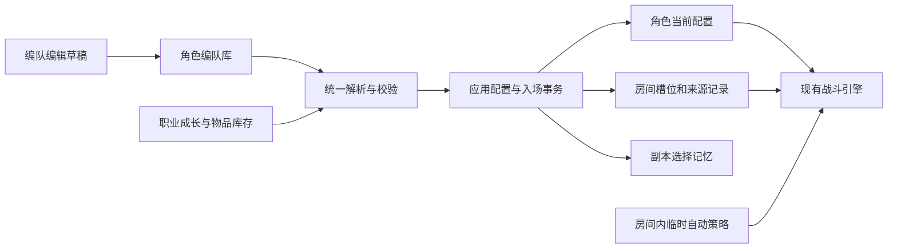

# 角色编队需求与架构设计

状态：第一版已实现，验证记录见文末。日期：2026-10-02。

目标是让玩家为不同副本提前保存完整的角色战斗配置，在创建、加入或安排角色入场时直接选择，并记住该角色上次挑战这个副本所用的编队。本文以当前仓库代码为依据，列出产品行为、数据边界、服务改造和实施验收。

用户已确认第一版范围为“每个角色切换整套配装”。现采用每个角色独立的六属性编队库，由服务端一次应用整套配置并入场。保留现有战斗计算和职业成长体系，补齐配置修改限制。这里的编队是一个角色的整套战斗配置；多人房间中的角色站位仍由房间管理。多名自有角色一起部署的整队模板可在此基础上扩展。

## 需求范围与默认值

用户明确提出的需求：

- 六个属性作为第一层分组，每个属性下可以保存和切换多套配置。
- 每套包含职业、技能、武器盘、药水、魂印等战斗配置。
- 创建或进入战斗时选择编队。
- 按副本或怪物记住选择，重复挑战时减少操作。

第一版采用以下规则：

| 项目 | 第一版实现 |
| --- | --- |
| 归属 | 已确认每个角色独立；不能引用另一个角色的武器或魂印 |
| 容量 | 火、水、土、风、光、暗各 6 个位置，共 36 个；`Formations:PositionsPerElement` 可设为 1–20，缩容保留已有位置 |
| 初始状态 | 只生成一套“当前配置”，其余位置为空、按需创建 |
| 分组含义 | 管理标签；实际攻击属性仍按现有主武器与技能规则计算 |
| 存档位置 | 服务端数据库；跨设备保留 |
| 记忆粒度 | 角色 + 副本稳定代码 + 层数；讨伐也使用其副本代码 |
| 保存方式 | 明确保存草稿；保存与应用分开，浏览编队不改变角色 |
| 战斗中 | 可以编辑、复制、保存预设；实际职业和装备选择保持本次入场配置 |
| 第一版排除 | GBF 的额外 Set 层、多角色整队模板、自动最优配装、分享码、完整独立玩家战斗快照 |

截图参考的是“属性分组、多个预设、概要卡片、入场选择”的交互关系。当前游戏没有截图中的召唤石与主副队成员系统，不在本次照搬这些机制。

## 改造前系统与改动依据

| 领域 | 当前实现 | 对设计的约束 |
| --- | --- | --- |
| 职业 | `Character.ProfessionCode` 表示正在使用的职业；`CharacterCombatProfession` 保存各职业等级、经验和一份技能记忆 | 切换必须归档与恢复真实成长，不能从编队复制等级和经验 |
| 技能 | 5 个 `CharacterSkillSlot`，包含顺序、技能代码、自动开关、条件和血量阈值 | 全部纳入编队，并在目标职业上下文检查已解锁和共享技能限制 |
| 武器 | 10 个槽位，1 号为主武器；槽位存于武器实例 `EquippedSlotIndex` | 保存实例引用；整体换盘必须处理槽位唯一约束 |
| 补给 | 治疗药水、强化药水、合剂共 3 槽 | 不应只按 `ConsumableRules.SlotCount = 2` 捕获；应覆盖 `TotalSlotCount = 3` |
| 魂印 | 一个装备槽和自动开关 | 保存魂印实例引用及默认自动策略 |
| 属性 | 六属性枚举已存在，武器盘效果依主武器属性等现有规则计算 | 分类标签不能直接更改战斗属性 |
| 入场 | Create、Join、Assign，以及预约 Join/Assign | 全部接入同一应用过程，不能只修改创建弹窗 |
| 战斗读取 | 房间槽位绑定 CharacterId，回合和房间预览读取角色当前配置表 | 增加 FormationId 本身不会形成隔离的战斗快照 |
| 编辑限制 | 职业在角色忙碌时不能切换；武器、技能等允许首次等待及 BattleOver 修改 | 必须堵住循环结算间隙改变实际配装的路径 |
| 自动策略 | 技能和魂印自动设置目前可在战斗中调整 | 与固定配装分开处理，保留战斗操作能力 |

对应代码入口（表中描述为改造前行为，当前代码已包含本文实现）：

- `Game.Shared/Models/Character.cs`、`CharacterCombatProfession.cs`；`Game.Server/Services/CombatProfessionService.cs`、`CombatProfessionProgressStore.cs`。
- `Game.Shared/SkillRules.cs`、`WeaponRules.cs`、`ConsumableRules.cs`、`SoulImprintRules.cs`。
- `Game.Server/Services/SkillService.cs`、`WeaponService.cs`、`ConsumableService.cs`、`SoulImprintService.cs`。
- `Game.Server/Services/RoomService.cs`、`RoomService.Operations.cs`、`RoomService.Formations.cs`。
- `Game.Server/Services/BattlePartyReader.cs`、`BattleExecutionContext.cs`、`BattleRoundExecutor.SoulImprints.cs`。
- `Game.Server/Services/DungeonRunLifecycleService.cs`；`Game.Server/Data/GameDbContext.cs`、`GameDbContext.Formations.cs`。

`CharacterCombatStatSnapshot` 和 `SkillBattleSnapshot` 是计算期间的快照，不能据此认为当前已经持久化了玩家的入场配装。当前技能目录也明确标记天赋树未启用，见 `SkillCatalog.cs`；遗留天赋字段不等于应当新增一套可切换天赋玩法。

## 玩家使用流程

### 编队管理

角色操作区新增“编队”入口（`/formations`），页面始终明确显示归属角色。上层六属性标签，下层展示六个编队位置。桌面端显示卡片网格与编辑详情，窄屏卡片纵向排列；不依赖长距离横向滑动查找配置。

每张卡片显示名称、职业及当前职业等级、实际主武器属性、主武器和魂印、药水库存摘要，以及“可出战”“未配置完整”“缺少物品”等状态。分组与主武器属性不一致时显示提示，不禁止混合配置。

选择卡片后，编辑区按“职业与技能 / 武器盘 / 补给 / 魂印”组织。提供新建、从当前角色复制、复制编队、重命名、移动位置、删除、保存、应用到角色。移动到已占用位置会显示已有编队名称并拒绝覆盖；切换卡片保留草稿，离开页面提示未保存内容。

重要操作含义：

- **保存**：更新这一套预设，不改变当前角色或已入场角色。
- **应用到角色**：角色空闲时一次切换全部配置，用于查看面板和继续调整。
- **使用此编队入场**：一个请求同时完成应用和入场；失败时全部回滚。
- **从当前角色复制**：明确复制当前生效配置；创建新编队，不自动覆盖旧预设。

旧职业、技能、武器和补给页面继续表示“角色当前配置”。手动改动后显示“当前配置已调整”，不反向覆盖来源编队；可从当前角色复制为新编队。编队编辑器使用独立草稿，不调用旧面板中即时生效的写接口。

### 创建与加入

创建副本的详情弹窗增加“出战编队”摘要，默认选中系统记忆的有效编队。无需每次重新打开完整选择器，可直接创建；点击摘要才展开六属性选择。

加入公开房间、通过房间链接进入后点击加入、房主安排自己的其他角色时使用同一选择器。查看房间与返回已占据的战斗不重新选编队，也不应用配置。

安排其他角色时，读取目标角色的编队库和副本记忆；不能沿用当前角色的编队 ID。房主仍不能修改其他玩家的角色配置。

角色入房后卡片展示“水·深层生存 / 入场版本 3”。随后保存同一预设为版本 4，显示“预设有新版本，下次入场使用”，本次房间继续版本 3 的配置选择。

第一版在加入槽位时就固定配置，首次准备前也不再直接换职业或换盘。需要更换时先离开或移出角色，再按新编队入场。以后若增加“准备阶段更换编队”，必须作为专门房间操作处理，清除准备状态并与自动开战竞争校验。

### 副本与怪物记忆

自动预选顺序：

1. 该角色、该副本、该层数上次成功入场的编队。
2. 玩家为该角色手动指定的默认编队。
3. 该角色最后应用且有效的编队。
4. 当前配置，或要求选择一套可出战编队。

不自动按克制关系替换玩家选择；坦克、治疗和机制配装可能需要不同属性。克制属性最多作为筛选建议。

深层 LV1 与 LV4 分别记忆；创建与加入同一个副本的同一层共用记忆。当前讨伐、旧怪物名称入口最终都会落到 `Dungeon`，因此第一版统一用 `Dungeon.Code`，不记录运行时生成的 `Monster.Id`，不按当前波次拆记录。

“记住用于本挑战”默认开启。仅实际入场事务成功后更新；预约提交、预览、取消、加入失败和回滚不修改记忆。关闭开关表示这次不更新既有记忆；另提供明确的“清除本挑战记忆”。

记忆引用已删除或不可出战编队时，提示原因并选用上述下一候选；提交时用户明确选择的编队若失效则返回问题，不在服务端悄悄换一套。预设更新后，下一次新入场使用当前版本，并展示当前内容。

## 保存内容与数据边界

| 内容 | 是否保存到编队 | 规则 |
| --- | --- | --- |
| 基础职业代码 | 是 | 使用现有可切换职业目录 |
| 五个技能槽和顺序 | 是 | 技能代码、自动开关、条件、阈值；不保存计算出的技能等级 |
| 十个武器槽 | 是 | 武器实例 ID；允许空副武器槽，主武器必须存在才能出战 |
| 三个补给槽 | 是 | 物品代码及适用的自动设置；合剂按现有启用规则 |
| 魂印 | 是 | 实例 ID，可为空；默认自动开关 |
| 名称、属性分类、位置 | 是 | 分类不改变战斗规则 |
| 职业等级、经验、共享技能解锁 | 否 | 使用角色实时成长；应用编队不得回滚成长 |
| 武器突破、技能强化、物品锁 | 否 | 属于同一物品实例，升级后引用它的编队自然获得升级效果 |
| 药水数量、货币、精通、任务进度 | 否 | 原系统持有，保存或应用编队不扣库存 |
| HP、冷却、状态、手动技能队列 | 否 | 属于战斗运行态，继续使用原状态与结算流程 |
| 快速施法开关 | 否 | 作为角色操作偏好保留，切编队不意外改变手感 |
| 房间自动战斗、循环、公开性、站位 | 否 | 属于房间或槽位 |
| 遗留天赋、进阶职业字段 | 第一版否 | 不复活已下线的配置流程；未来独立明确规则再接入 |

同一个武器或魂印可以被同一角色的多个编队引用，不复制、不额外占用物品；同一个编队内，同一武器实例不能出现在两个槽。

第一版保护所有未删除预设引用的物品，包括不完整草稿：出售、分解或作为强化材料消耗时，返回引用编队清单，先替换或移除这些引用。该保护独立于物品的手动锁。处理旧存档、配置下线等遗留缺失时，将编队标记为不可出战，不按同名物品自动补位。

药水零库存可以保存，也可以携此配置入场，但展示醒目缺货提示；实际使用仍按库存与现有使用次数规则检查，不自动替换药品。批量回收和强化材料选择必须过滤预设引用，不能只检查当前是否装备。

## 第一版架构

### 编队预设与当前配置

保留三种职责：编队库保存可编辑的选择；角色当前配置作为现有战斗引擎读取的生效数据；房间记录本次应用的选择和来源版本。三者使用不同状态标识，不能只用一个 `ActiveFormationId` 推断内容永远一致。

第一版记录的是**选择快照**，用于显示和恢复校验，不是冻结所有面板数值和规则的独立战斗角色。职业升级、奖励、补给消耗继续遵循原规则；编辑预设不会更换当前房间的职业、技能或装备选择。

暂不引入完整 BattleActor 存档，是因为这会同时影响每回合武器、技能、补给、魂印读取、房间展示、奖励归属及恢复逻辑。未来只有需要“同一角色独立参与多个战斗”或“入房后随意修改实际装备而不影响战斗”等能力时，再评估这层重构。

### 数据模型

界面可以视为 `formations[element][position]`；数据库采用稳定 ID 与唯一位置约束。改名、移动和排序不会改变 ID，也不会破坏副本记忆。

新增模型：

| 模型 | 关键字段与约束 |
| --- | --- |
| `CharacterBattleFormation` | Id、CharacterId、GroupElement、Position、Name、ProfessionCode、SoulImprintId、SoulAutoUseEnabled、Version、IsDeleted、创建/修改时间 |
| `FormationWeaponSlot` | FormationId、SlotIndex、WeaponId；编队内槽位唯一，非空实例不能重复 |
| `FormationSkillSlot` | FormationId、SlotIndex、SkillCode、AutoUseEnabled、AutoConditionOverride、AutoHpThresholdPercent |
| `FormationConsumableSlot` | FormationId、SlotIndex、ItemCode、AutoUseEnabled、AutoHpThresholdPercent；覆盖三个槽 |
| `CharacterFormationState` | CharacterId 主键、DefaultFormationId、AppliedFormationId、AppliedFormationVersion、AppliedChoiceHash、Version |
| `CharacterBattleFormationPreference` | CharacterId、DungeonCode、DepthLevel、FormationId、Version、LastUsedAtUtc；前三者唯一 |
| `BattleAdmissionReceipt` | UserId、RequestId 唯一，Action、规范化请求摘要、RoomId、CharacterId、Result；与成功入场一起提交 |

使用关系子表管理可查询的物品引用，避免每次回收扫描所有 JSON。为武器和魂印反向引用建立索引。位置唯一约束仅覆盖未删除编队；职业、技能和物品归属还须经过服务端校验。

删除保留编队头记录作为逻辑删除标记，同时移除该预设的子表选择、清空魂印引用，清除该角色的默认项和指向它的副本记忆，释放位置与回收保护。这样已删除预设的外键不会继续阻止物品回收。已生效角色配置、房间来源记录、已接受的预约快照保持独立。删除提示应说明已入场或已预约使用的配置不会随之撤回。

`CharacterFormationState` 只描述应用来源和默认项；当前配置是否已手动调整，用当前选择与上次应用时保存的摘要比较，不能与来源预设的最新版本比较。保存版本 4 后仍使用版本 3，应显示“来源预设有更新”，不误报手动调整。摘要不包含 HP、经验、库存数量和强化数值，避免正常成长被误认为换装。

现有模型扩展：

- `RoomSlot`：来源编队 ID、版本、入场名称、`AppliedLoadoutJson`、`AutoPolicyOverridesJson`。JSON 带 SchemaVersion，保存选择代码/实例 ID/默认策略，不保存运行血量。
- `RoomOperation`：预约的编队 ID、版本、名称、`RequestedLoadoutJson`、是否更新记忆、RequestId。离开、移除和单纯换位不要求新编队。
- `Room`：持久化配置一致性异常标记与原因，阻止异常房间继续手动或自动执行战斗。
- 房间显示 DTO：增加来源摘要、当前是否有临时策略、预设是否有新版本；不在大厅每张卡加载所有装备详情。

结构选择摘要只包含职业、技能代码与顺序、武器实例与槽位、补给代码、魂印实例。基础自动策略另行比较；房间临时覆盖单独校验，不纳入结构摘要或角色当前配置的手动调整判定。

不支持的 JSON SchemaVersion 返回明确错误并保留原数据，禁止作为空配置静默覆盖。

### 服务职责

| 服务 | 责任 |
| --- | --- |
| `FormationService` | 编队读写、复制、移动、逻辑删除、版本冲突处理；独立于是否正在战斗 |
| `CombatLoadoutService.CaptureManyAsync` | 批量读取角色当前选择，形成统一输入；四次查询覆盖所有参战角色 |
| `CombatLoadoutService.PreviewAsync / PreviewManyAsync` | 用最新成长、技能目录、物品实例解析目标配置，输出预览与完整问题列表；整库预览共用同一批库存与职业数据 |
| `CombatLoadoutService.ApplyAsync` | 不自行提交事务；归档/恢复职业进度，整体换槽，计算生效属性 |
| `RoomService.Formations` | 协调 Create、Join、Assign 和预约执行；掌握事务、并发、来源记录和副本记忆 |
| `CombatLoadoutMutationPolicy` | 统一直接改装、强化、回收与入场之间的配置修改限制 |
| `FormationService.RecommendAsync / RoomService.Formations` | 推荐选择与成功入场后的记忆更新 |
| `BattleAutoPolicyResolver` | 合并入场默认策略与本房间临时覆盖，供执行和展示共用 |
| `BattleLoadoutIntegrityService / CombatLoadoutCodec` | 版本化选择快照、规范化摘要与配置一致性检查 |
| `FormationBackfillService` | 启动时幂等捕获旧角色、已有房间与预约；首次打开新角色编队库时初始化 |

读取、预览和应用合并在 `CombatLoadoutService`，入场协调放在现有 `RoomService` 的部分文件中。遵循现有单机 EF Core / SQLite 架构，不增加外部缓存或分布式锁。

## 关键算法与一致性

### 校验与预览

先完整解析，再整体应用。校验必须涵盖：角色权限、目标基础职业、目标职业实时等级、已解锁技能、最多一个共享技能、技能不重复、自动条件合法、武器实例归属、十槽不重复、主武器存在、魂印归属、药水类型与阈值。

不能调用旧职业技能恢复中的容错清空逻辑来“修好”入场编队。玩家明确选择了不可用技能时，应指出具体槽位并停止入场。

草稿保存允许尚未选择主武器等不完整状态；非法字段、越权实例和无效槽位仍拒绝。缺主武器或已下线技能阻止出战；药水缺货、分组属性与实际主武器不一致仅提示。返回统一 `issues[]`，包含 code、severity、section、slotIndex、message，供卡片、编辑器与入场复用。

预览不得临时修改 EF 跟踪的 Character 再恢复。用目标职业上下文和显式槽位构造无副作用的解析结果，复用现有技能目录及武器加成公式；保存的面板数字不能作为战斗输入。

### 整体应用与入场

1. 校验身份与请求，明确 CharacterId，读取 RequestId 回执；同 ID 不同内容返回冲突。
2. 在调用方唯一事务中重新读取角色、目标预设版本、物品和房间状态。检查角色是否空闲、目标槽位和副本准入；需要职业等级的既有检查使用目标职业上下文。
3. 校验 ExpectedFormationVersion 与客户端预览一致。重新解析全部选择，任何阻断问题都不修改当前配置。
4. 通过 `CombatProfessionProgressStore` 保存当前职业的真实等级/经验，恢复目标职业最新进度。离开职业前捕获其当前技能到旧 `SkillLoadoutJson`；恢复目标成长后直接写显式编队技能，不再执行目标职业缓存的技能恢复。旧缓存仅供普通职业切换兜底，保存预设不写该缓存。
5. 在同一事务内先清除旧装备槽位并保存，再写入新槽位和完整技能/补给/魂印配置，避免 SQLite 唯一索引冲突。中间保存不提交。
6. 按现有公式重算角色属性。空闲单独应用时使用 `min(原 HP, 新有效 MaxHp)`，避免切配装免费回血；入场按现有规则补满生命，不携带其他战斗冷却或增益。
7. 写房间与角色槽位、活动占用和入场来源记录；递增 Character/Room 及相关实体的并发版本。设置副本记忆并写幂等回执。
8. 一次提交后返回房间详情；错误时回滚所有写入并清理跟踪状态。

Create、Join 和新角色 Assign 共用显式事务；预约执行已经持有事务时建立保存点并复用它。客户端一次请求整套入场，不串行调用换职业、换技能、换盘、换药水、换魂印、加入房间等多个接口。

所有直接配置写入都参与角色并发版本，入场与它们相互排斥。仅在写入前查一次忙碌状态不足以防竞态；数据库版本和唯一占用约束是最终保证。批量写失败后，不在脏的 DbContext 中继续完成预约或生成成功响应。

创建、加入的响应丢失后复用同一 RequestId 获取同一次入场，避免重建房间或重复更新记忆。事务前和取得事务后都查询回执，数据库唯一约束提供最终保证；冲突时回滚并清空跟踪状态，再读取已提交回执。同摘要返回原房间标识及当前详情，原房间已移除则返回保存的结果；不同摘要返回请求冲突。回执命中时也先清除可能过期的角色跟踪状态，避免将并发成功后的新配置误报为房间不一致。空闲应用接口返回其原始应用结果，不重新执行。入场回执独立于生产/商店的 `LogisticsRequest`。

### 实际配置锁与临时策略

从角色占据房间开始，到离开、移出或房间真正释放角色为止，固定职业、技能选择与顺序、武器盘、药水选择、魂印选择。BattleOver 只是回合流程状态，循环房间在该状态下仍占用角色，不能据此解除锁。

统一政策覆盖当前配置 API、职业切换、武器强化和突破、装备回收等间接修改路径。物品手动锁、查看库存、保存预设和不改变战斗配置的生产行为保持其原有规则。职业已有的其他活动限制继续保留，不借编队绕过。

为保留当前战斗中调技能自动条件和魂印自动开关的能力，将这些写入本房间槽位的 `AutoPolicyOverridesJson`，不再写入角色的基础配置或保存的预设。战斗执行、预览和设置面板通过同一个合并函数读取有效策略；修改时递增 Room.Version，与回合执行竞争。

临时策略在同一房间循环和重试时保留；离开或移除角色时清除。房间自动战斗开关、手动技能队列、目标选择继续使用原字段。快速施法仍为角色操作偏好。第一版不额外增加原先不存在的药水战斗中换槽能力。

### 预约加入和换人

预约接受时持久化玩家当时确认的完整选择和版本。等待过程中编辑或删除原预设，不改变已接受预约；取消预约使用现有取消操作。

预设版本匹配发生在预约接受时。执行时以 `RequestedLoadoutJson` 为权威，不要求原预设仍存在或保持同一版本；重新检查角色空闲、目标房间和槽位、物品仍持有、技能仍可用等条件。允许武器在等待期间强化：快照固定的是实例选择，最终数值按执行时真实实例计算。缺失物品或失效技能则预约失败并显示原因，不自动转用新版本。

预约不占用药水库存，不立即切职业，不写入副本记忆。预设删除后已接受预约仍可能使用其快照；此时来源保留，但成功执行不创建指向已删除编队的新记忆。

现有预约去重比较须加入选择摘要或来源版本；“相同角色和位置、改选另一套编队”不能被当作旧请求返回。新预约对旧冲突预约的替换规则保持一致。

### 换位 续战与重启

Assign 必须区分新角色入场与已在本房间的角色换位。单纯换位只检查原有权限、房间状态与并发，不要求角色空闲，不重新应用编队、不更新副本记忆；同时请求换位和更换编队时拒绝，避免绕过配装锁。

槽位交换时，来源记录和临时自动策略随角色一起移动，不留在原房间位置。移除或替换角色时清除旧绑定，不能继承前任的编队。

循环开始、手动重试和波次切换不重新应用最新编队，不重置职业经验，也不重写记忆。继续使用已经应用的实际选择和房间策略；药水计数、冷却、状态仍由原生命周期代码按现有规则清理。

服务重启从数据库恢复角色当前配置、槽位来源和临时策略，禁止以“最新预设”重建运行中的房间。发现选择记录与实际结构性配置不符时，持久化异常状态并报告原因，修复前同时阻止准备触发回合、直接执行和后台推进，不能悄悄换装。房间展示和预览使用同一检查结果，不把异常数值作为可出战预览。该校验只比较结构选择，不把奖励升级、库存变化或合法临时自动策略当成不一致。

## 接口与客户端改造

角色作用域：`/api/user/characters/{characterId}/formations`，由 `FormationController` 提供。

| 操作 | 请求重点 |
| --- | --- |
| 列表与详情 | 返回容量、版本、概要、可出战状态及默认项 |
| 新建与从当前配置创建 | 名称、分组、位置；显式来源 |
| 保存与移动 | ExpectedVersion，完整选择或位置；同一位置并发创建返回冲突 |
| 复制 | 源 ID/版本、目标位置；不共享可变子表 |
| 删除 | ExpectedVersion；清理默认项、记忆与引用，返回更新后的编队概览 |
| 预览与校验 | 接受已保存编队或草稿，返回解析面板与 issues |
| 空闲应用 | FormationId、ExpectedVersion、ExpectedCharacterVersion、RequestId |
| 推荐与清除记忆 | CharacterId、DungeonId/Code、DepthLevel，由服务端规范化目标 |

CreateRoomRequest、JoinRoomRequest、AssignRoomSlotRequest 和预约 Join/Assign 增加统一 `LoadoutSelection`：mode（SavedFormation/Current）、formationId、expectedVersion、rememberForEncounter，并显式带 CharacterId。客户端发送的是用户确认的角色，服务端校验归属，避免用户在另一个标签页切角色造成错配。

加入时副本代码和层数从服务端房间读取，不能信任客户端传来的副本记忆键。旧请求缺少选择参数时，兼容为 Current，不猜测预设；当前角色配置也经过同一解析和来源记录流程，且不建立指向不存在编队的记忆。新增参数应端到端接通，不能仅在 DTO 中定义。

客户端实施位置：

- 新增编队管理页面、编队概要卡和可复用选择器。
- `Game.Client/Components/MonsterDetailDialog.razor`：创建弹窗出战摘要；`Pages/Rooms.razor`：携带选择提交。
- `Game.Client/Pages/Battle.razor`：加入、安排角色、预约操作接选择器，返回已有战斗不触发选择。
- `Pages/Formations.razor`：独立草稿编辑器，共享既有职业、武器、补给和魂印目录读取；旧 `Character*Board` 继续操作当前配置，并正确提示入房期间的修改限制。
- 切换角色后丢弃旧角色的候选结果；通过现有角色上下文机制隔离异步请求，不能把上一角色的晚到响应覆盖新角色。
- 预设概要批量查询并计算引用有效性；列表不逐套请求完整库存，房间列表不展开所有编队详情。

## 迁移与发布

1. 增加表、索引和可空房间字段；不改写现有武器归属、等级、库存和冷却。
2. 每个角色捕获一套现有配置作为“当前配置”，按主武器元素分组；缺少主武器时保留草稿状态，不凭空生成装备。其余位置不预填重复内容。
3. 不把各职业旧 `SkillLoadoutJson` 当作完整编队迁移，因为它们没有对应武器、药水与魂印。
4. 迁移时已有房间根据当前真实配置建立 LegacyCurrent 来源，不能重置 HP 或应用新预设。已有预约没有记录历史选择，无法恢复未知的预约时配装：升级时从目标角色当前配置捕获一次 LegacyCurrent，并标明这一兼容规则。
5. 数据库结构迁移与配置捕获分开：捕获可用应用层幂等回填，期间服务尚未开放新写入和后台推进。启动重复执行不得重复创建编队。快照完整后再开放入场流程。
6. 首版继续兼容 Current 入场和旧配置页面；前后端成套发布，旧配置写请求仍受服务端统一政策约束。
7. 使用临时旧版数据库演练迁移、重启和恢复；真实发布遵循现有 [单机运维说明](single-host-operations.md)。回退使用匹配版本的程序与备份，不自动丢弃新编队数据。

## 实施任务与分工

T1–T8 已完成；主代理负责解析、整体应用、入场事务与复杂一致性逻辑，三名 6.1 Sol 子代理分别处理数据管理、策略与测试、客户端与浏览器验证。T9 的实际验证结果见下文。

| 任务 | 内容 | 主要负责 | 依赖与完成标准 |
| --- | --- | --- | --- |
| T1 配置契约 | 选择 DTO、校验问题、保存/应用语义、自动策略覆盖、版本规则 | 主代理 | 固定字段和错误语义；包含全部五类配置及三个补给槽 |
| T2 数据与迁移 | 编队子表、状态、记忆、引用索引、回执、房间扩展和旧数据回填 | 6.1 Sol | T1；现有数据不丢失，重复回填幂等 |
| T3 解析与应用核心 | 目标职业校验、无副作用预览、职业成长保存、整体换槽和回滚 | 主代理 | T1/T2；失败不产生半套配置，当前与预览规则一致 |
| T4 编队管理接口 | CRUD、复制、移动、版本冲突、反向引用与回收保护 | 6.1 Sol | T2/T3；跨角色拒绝，复制独立，删除清理记忆 |
| T5 入场整合 | Create/Join/Assign 的统一事务、请求重试、成功记忆 | 主代理 | T3/T4；所有实际入场均采用用户确认的选择 |
| T6 房间一致性 | 写入政策、预约冻结、换位绑定、循环/重启、临时自动策略 | 主代理 | T3/T5；循环和编辑预设不能串配置，原战斗控制可用 |
| T7 编队编辑界面 | 六属性多位置、概要、草稿组件、保存/应用状态 | 6.1 Sol | T1/T4；编辑未应用预设不会修改当前角色 |
| T8 入场界面 | 创建/加入/安排/预约统一选择器，自动预选、问题定位 | 6.1 Sol | T5/T7；有效记忆下一次可直接入场 |
| T9 回归与交付 | 迁移、事务、并发、浏览器核心流程、查询预算、发布说明 | 6.1 Sol 执行，主代理审查 | T2–T8；满足下方验收，更新实际验证记录 |

任务按以上依赖完成整合；客户端验收已连接真实服务和独立临时数据库，没有用固定响应替代入场流程。

## 验收场景

| 场景 | 预期 |
| --- | --- |
| 同职业两套不同技能/武器盘 | 一次切换后所有槽位正确，旧职业技能记忆不覆盖显式编队 |
| 两个不同职业切换并获得经验 | 各职业经验分别保留，切换和失败回滚不回退/复制经验 |
| 火副本 LV1 与 LV4 | 分别记住选择；另一角色不继承该记忆 |
| 改名、移动位置、删除 | 改名移动保持记忆；删除清除指向它的默认项与记忆 |
| 同武器被多套引用 | 正常复用；同一套重复实例被拒绝；回收显示所有引用 |
| 药水缺货和缺主武器 | 前者提示但可入场，后者阻断；不提前消耗药水 |
| 换盘中间任一步失败 | 角色职业、经验、武器、技能、药水、魂印、活动和记忆全部回滚 |
| 入场与换装/升级/回收并发 | 只有一致的操作成功，无混合配置；数据库最终约束有效 |
| 两个请求抢同一槽位 | 一方成功，失败方不改变自己的当前配置 |
| 同一 RequestId 网络重试 | 返回同一次入场结果；不同内容复用编号被拒绝 |
| 预约后修改或删除预设 | 执行接受时的选择；物品失效则明确失败，不改用最新预设 |
| 预约、取消和后台执行并发 | 只执行一次；重选另一编队不会被错误去重 |
| 战斗中保存新编队版本 | 当前技能和装备不变；下一次新入场可以使用新版本 |
| 更新当前配置的来源预设 | 显示来源有新版本，不误报当前配置被手动调整 |
| 首次等待与循环 BattleOver | 不能绕过实际配置锁；预设仍可编辑 |
| 战斗中修改技能/魂印自动设置 | 仅作用于本房间；重启保留、离场清除，预设不被覆盖 |
| 换位与替换角色 | 来源与策略跟随角色；新角色不继承旧绑定 |
| 自动循环和手动重试 | 不读最新预设，不重置成长；冷却和补给计数沿用现有规则 |
| 服务进程重建 | 从数据库继续同一选择与策略，不以新预设覆盖运行状态 |
| 临时自动策略调整后重启 | 合法覆盖正常恢复，不被当作结构性换装异常 |
| 检测到持久化配置与来源不一致 | 同时阻止手动和后台推进，展示具体原因，不自动替换为最新预设 |
| 多标签页切换角色 | 入场仍绑定用户确认的 CharacterId；异步界面响应不串角色 |
| 旧存档和已有房间升级 | 只新增捕获记录，战斗状态、真实资产、职业进度完整保留 |

服务端使用真实 SQLite 的事务和并发测试，复用现有 RoomServiceTests、RoomOperationTests、CombatProfessionServiceTests 等基线。现有 RoomLoadRecoveryTests 主要覆盖客户端加载失败，不替代服务重启恢复验证。

验证组合覆盖：同一角色创建两套不同职业编队、分别成功进入 LV1/LV4 后独立推荐、战斗期间保存新版预设、用新数据库上下文恢复并循环后保持入场配置。浏览器覆盖管理与入场主流程；深层 LV1/LV4 的记忆隔离通过服务测试验证，没有声称手动跑完两层战斗。

## 实施与验证记录（2026-10-02）

- 数据结构迁移：`20261002010000_AddBattleFormations`；SQLite 升级、降级与历史列播种测试已接入。启动在 `DbInitializer` 后、开放服务与后台扫描前执行幂等回填。
- 容量配置默认为每属性 6 套。可在服务配置添加 `"Formations": { "PositionsPerElement": 6 }`，范围 1–20。已有更高位置不会因缩容丢失或隐藏。
- 新增 `FormationServiceTests`、`FormationAdmissionTests`、`FormationBattlePolicyTests`、`FormationAutoExecutionTests`、`FormationRequestClientTests`。覆盖独立保存/复制/删除、成长恢复、整套回滚、归属与技能校验、预约修改/删除预设、来源随换位移动、循环与恢复、物品引用保护、临时策略、重复入场和并发应用。
- 并发测试使用文件 SQLite 与两个独立数据库上下文，同步启动入场/应用或两次同编号入场；检查最终配置摘要、唯一房间、回执、活动占用和记忆更新次数。
- 真实浏览器已验证六属性管理、新建不完整草稿、从当前角色复制、保存改名、复制、切换目标职业技能、整体应用、创建入场、战斗中保存新版但当前战斗配置不变，以及安排第二角色时读取其独立编队库。
- 390px 窄屏下可视宽度与内容宽度均为 375px，无横向溢出。截图与记录保存在 `.codex-tmp/formations-ui/`。
- 完整解决方案构建成功（0 错误）；`git diff --check` 通过。最终全量测试共 1436 项，1432 通过、4 失败；编队相关测试通过。结果文件为 `.codex-tmp/formations-tests/formations-final.trx`。
- 四项失败来自本轮测试期间另一路工作对魂印配表的修改，原测试仍断言旧参数：`HealingSoulImprintHealsPartyAndCleansesDebuff`（治疗 24% → 10%）、`GuardSoulImprintReducesTheCurrentMonsterAttack`（减伤 50% → 30%）、`CooldownSoulImprintOnlyReducesClassSkillCooldowns`（缩短 2 → 1 回合）以及 `ArmorBreakSoulImprintAppliesItsConfiguredStatus`（破甲状态代码变更）。保留这些并行修改；没有为使回归转绿而还原配表或放宽断言。
- 将本轮最终构建的程序与测试程序集放入隔离验证目录，使用 `HEAD` 的原配表副本复跑以上四项，4/4 通过。记录为 `.codex-tmp/formations-tests/formations-baseline-souls.trx`。因此不能将当前共享工作区的全量结果写成全部通过；魂印配表与对应测试的同步属于该并行工作。
- 本轮测试使用独立临时存档；未重启真实游戏服务或修改真实玩家存档。发布时仍按现有单机运维流程备份并部署前后端，迁移和回填由新服务启动执行。
