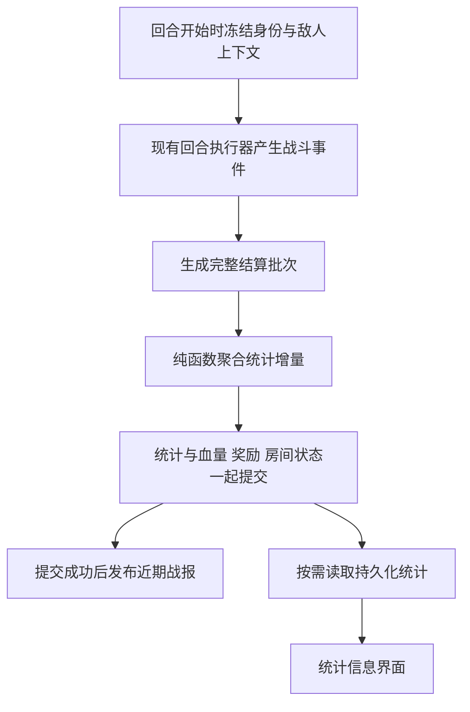

# 战斗统计需求与架构设计

状态：首版已实施，专项测试与首批浏览器验收完成；范围切换、重置及重启验证继续进行。日期：2026-10-02。

目标是让玩家通过角色输出、生存、治疗和辅助数据判断配队表现。建议把现有战利品入口升级为“统计信息”，提供“战斗统计”和“掉落物”两个页签。统计在服务端随战斗结算持久化，现有 LOG 继续承担近期战报和动画回放。

本文保留最初的需求与架构设计正文。用户随后批准实施，当前已完成的功能和实际验收结果见文末“实施与验收实录”；设计正文中的建议与验收场景不自动代表所有场景均已验证。

## 当前系统与设计依据

| 当前实现 | 对设计的约束 |
| --- | --- |
| `BattleLogStore` 在进程内保存每房间最近约 80 条日志和事件，完整保留最新结算批次；默认 2 小时失效，最多 256 个房间 | 不能读取这段历史来还原整局统计；扩大日志上限也不能解决重启丢失 |
| `BattleEventResponse` 已有来源、目标、行动类型、技能代码、实际量、计算量、前后 HP、挑战轮次和回合号 | 首版多数数值可直接使用结构化事实，无需解析中文 LOG |
| `BattleService` 开启事件记录、执行完整回合、处理波次和奖励，保存成功后才发布事件 | 统计需要在这次保存之前准备，并与战斗一起提交；不能等发布到内存日志后再单独写库 |
| 事件只描述发生的效果，没有完整的参战名册与回合完成记录 | 零输出、冻结、阵亡角色的统计行和回合分母需从结算上下文补充 |
| `RunSequence` 表示第几次挑战，`RoundNumber` 表示本次挑战已完成的回合数 | UI 使用“第 N 次挑战”和“第 M 回合”，避免两个概念都写成“本轮” |
| `RoomRewards` 已提供个人累计收益、角色切换、掉落来源和待结算标记 | 直接作为掉落物页签复用，统计查询与奖励查询保持各自职责 |
| 战斗页约每 2 秒读取战斗快照，奖励详情独立按需读取 | 统计详情也按需读取，不塞入每次战斗快照 |
| 自动重复与手动重置都会增加 `RunSequence`；关闭房间会清空槽位中的角色及编队信息 | 统计保留历史名册，不能依赖结束后的当前槽位或角色当前配置 |
| 当前守护是百分比减伤，事件只记录最终伤害 | 不能直接展示“护盾吸收”或把计算量与实际量之差当成减伤贡献 |

主要代码入口：

- [战斗事件契约](../Game.Shared/Dtos/BattleEventResponse.cs)、[事件采集器](../Game.Server/Services/BattleEventCollector.cs)、[近期日志缓存](../Game.Server/Services/BattleLogStore.cs)。
- [回合提交入口](../Game.Server/Services/BattleService.cs)、[回合执行器](../Game.Server/Services/BattleRoundExecutor.cs)、[状态服务](../Game.Server/Services/BattleStatusService.cs)。
- [挑战生命周期](../Game.Server/Services/DungeonRunLifecycleService.cs)、[房间关闭](../Game.Server/Services/CharacterActivityManager.cs)。
- [战斗页面](../Game.Client/Pages/Battle.razor)、[战利品组件](../Game.Client/Components/RoomRewards.razor)、[按需读取与快照接口](../Game.Client/Services/ApiService.BattleSync.cs)。
- [事件回归测试](../Game.Server.Tests/BattleEventTests.cs)、[模拟器指标](../tools/Game.BalanceSimulator/SimulatorMetrics.cs)。模拟器可参考事件归属和死亡判定，不能直接作为生产统计服务使用。

## 首版需求

### 统计范围

| 范围 | 行为 |
| --- | --- |
| 本次挑战 | 默认选择，包含本次挑战所有已结算回合，进行中持续更新 |
| 上次挑战 | 自动刷本开始下一次后仍可查看上一局结果；第一局显示不可用 |
| 房间累计 | 合并当前房间所有已记录挑战，包含进行中的挑战；不跨房间 |
| 单个敌人 | 在本次或上次挑战内，切换全部敌人或某只敌人，便于单独看 Boss；房间累计首版不提供跨挑战敌人筛选 |

“上次挑战”固定为当前挑战序号减一，不能跳过缺失记录而悄悄展示更早一局。房间累计包含胜利、失败及停止前已经结算的回合，并显示已完成挑战数和当前挑战状态。多局历史列表、跨房间对比放到后续。

掉落页签首版沿用“我的房间累计收益”，不共用战斗页签的范围筛选。切到掉落时隐藏战斗范围，避免选择“本次挑战”却展示累计掉落。

### 角色指标

| 指标 | 首版口径 | 展示位置 |
| --- | --- | --- |
| 实际伤害 | 角色对敌方造成的 `Damage.ActualAmount` 总和 | 角色列表与详情 |
| 回合均伤 | 实际伤害除以当前所选范围内已记录的结算回合数 | 角色列表与详情 |
| 伤害占比 | 角色实际伤害除以全队角色实际伤害 | 输出列表 |
| 承受伤害 | 目标为该角色的实际战斗伤害总和，包含持续伤害与反射 | 生存列表与详情 |
| 有效治疗 | 该角色对己方角色实际恢复的 HP 总和，包含自疗 | 治疗列表与详情 |
| 对队友治疗与自疗 | 按来源角色是否等于目标角色拆分；药水恢复另列子项 | 角色详情 |
| 受到治疗 | 该角色实际收到的治疗总和，包含自疗、药水和持续恢复 | 生存列表与详情 |
| 阵亡次数 | 伤害事件使 HP 从大于 0 变成 0 的次数 | 生存列表与详情 |
| 在场与存活回合 | 回合开始时在队的回合数，以及其中回合开始时 HP 大于 0 的回合数 | 角色详情 |
| 净化与驱散 | 实际成功移除的状态条目数，一条多层状态仍计一项 | 辅助列表与详情 |
| 成功打断 | 实际取消敌方行动的成功次数 | 辅助列表与详情 |
| 伤害与治疗来源 | 按普攻、技能、魂印、追击、反击、持续效果、机制、消耗品拆分，再按稳定代码查看明细 | 角色详情 |

列表不一次铺开全部列：提供“输出、治疗、生存、辅助”指标切换；默认输出，角色详情集中展示其他数据。首版不生成综合战力分、MVP、自动配队建议，避免把坦克、治疗和输出强行排成同一贡献榜。

### 回合均伤的确定口径

默认使用统一的范围回合数，方便横向比较全队对战斗推进的实际贡献：

`回合均伤 = 当前范围内角色实际伤害合计 / 当前范围内已记录的结算回合数`

例如战斗已结算 10 回合，角色造成 1000 伤害，即使只存活 5 回合，默认均伤仍为 100。角色详情显示“在场 10 回合，存活 5 回合”，帮助区分配装输出与生存损失。中途加入的角色也使用同一范围分母，同时明确显示加入后的在场回合。

回合开始时仍在槽位的阵亡角色计入在场回合，不计入存活回合；本回合中途阵亡仍算本回合存活。冻结、技能空转、来不及出手便击杀敌人的角色，只要回合开始时在场且存活，也计入对应分母。离线 Auto 正常计算，准备等待、冷却等待、波次切换倒计时和重复挑战倒计时不算回合。

房间累计均伤用“累计伤害除以累计结算回合”，不能把各局均伤相加或直接平均。累计回合从挑战或敌人汇总表计算，不能把每名角色的回合数相加。无已结算回合或没有占比分母时显示“—”。

### 数值与归属规则

1. 敌人剩 10 HP，攻击计算量为 100，实际伤害只计 10。计算量已经过防御、减伤等处理，不是减伤前的原始伤害。
2. 一次多段、群攻或带追击的行动，每个实际伤害事件各计一次；总伤害与来源拆分之和必须一致。
3. 持续伤害与持续治疗归属于状态保存的提供者。当前同一状态按刷新或较强快照规则保留一个来源，统计沿用它，不重新分摊给所有施加者。
4. 来源角色阵亡或离开后，仍按其稳定角色 ID 累计已归属的持续效果；不把来源改成当前同槽位角色。
5. 来源身份缺失时保留“环境或未归属”数据，不猜测属于谁。来源角色 ID 已知、仅名称或配置缺失时，仍计入该角色，身份摘要标为未知，不能转成环境伤害。全队输出占比只在已归属角色输出内计算，环境伤害在概览另列。
6. 净化、驱散计入执行清除操作的角色；被移除状态原提供者保留在状态快照中，不得当成辅助贡献者。自然过期、消耗层数、换怪清理与挑战清理都不计净化或驱散。当前成功移除只产生一条 `Cleanse` 或 `Dispel` 事件，正常由行动作用域提供操作者；实施时须明确这两类事件的顶层来源只能取执行者，缺少执行者时保持未知，不能沿用采集器通用回退规则填成状态原提供者。
7. 角色死亡从 HP 变化判断；现有 `Defeat` 事件只覆盖敌人，不能用于统计角色阵亡。伤害与对应 `Defeat` 不能重复累计。
8. 药水治疗既属于使用者自疗，也属于其受到治疗；两者是不同维度，不可相加当作治疗总量。怪物自疗不进入玩家有效治疗。
9. 重开回满 HP、离队恢复、升级或最大 HP 改变引起的血量变化不属于战斗治疗或承伤，不能用回合前后 HP 差代替事件。
10. 金额、回合累计与次数使用 64 位整数；比率按需计算，最终显示时再四舍五入。未知数据与真实的零值分开表示。

### 历史身份与配置

按 `CharacterId` 识别角色，槽位只用于展示。记录当时的名称、职业、属性、归属用户及编队名称和版本；重命名、换职业、编队更新、角色离队不能改写旧统计的含义。

同一角色在一个挑战内离队换配置再加入，首版仍合为一行，但保存配置摘要的变化，标记“使用过多个配置”，不能把整局合计标在最后一套配置名下。配置摘要只用于解释数据，不承担重新模拟战斗的能力。当前配置摘要以本次结算开始时的名册为准，旧持续效果来源只补充缺失身份，不覆盖已记录的配置；跨敌人补名字时不能复制之前敌人的参战回合。精确按每次入场分段比较放到后续，需要给效果来源补充入场段标识。

## 统计信息界面

原“战利品”快捷入口改名为“统计信息”。首次进入默认“战斗统计”，同一页面再次打开保留用户上次页签、指标和角色选择。底部最新战报入口及现有战斗记录弹层保留。

示意布局如下，数字仅为演示：

```text
统计信息                                            关闭
[ 战斗统计 ]  [ 掉落物 ]

范围 [本次挑战 v]    敌人 [全部 v]
第 12 次挑战 · 已结算 24 回合 · 战斗进行中
全队实际伤害 120,000    有效治疗 8,500    阵亡 1

[ 输出 ] [ 治疗 ] [ 生存 ] [ 辅助 ]
角色          实际伤害        回合均伤        占比
角色甲         54,000           2,250          45%
角色乙         42,000           1,750          35%
角色丙         24,000           1,000          20%

选中角色详情
职业与属性 · 当时使用的编队 · 在场及存活回合
伤害来源条形图 / 技能明细 / 治疗与承伤 / 辅助行为
数据截至第 24 回合结算
```

演示仅展示三名角色；实际列出全部已参战角色，包括零输出、阵亡和已离队者。尚未结算首回合时可以展示当前名册的零值占位，并提示“尚未结算首回合”。

现有奖励弹层约 540px 宽，整个战斗页也有宽度约束，首版采用紧凑列表和角色详情，不依赖扩大全局页面放宽表格。手机显示角色卡片，突出当前指标及均值；详细数值在点击后展开。条形图同时保留数值和文字，不仅靠颜色区别角色。

房间关闭后的结束页复用同一统计内容组件，显示最后一场或累计数据，不能继续只显示掉落。保留 Escape、遮罩关闭、焦点回到触发按钮、键盘页签操作和滚动区域。打开奖励不请求全部战斗来源明细，打开统计也不强制请求奖励。

网络失败保留最后一次成功结果，显示“更新失败，数据截至第 N 回合”和重试。切范围时旧数据不能配上新标题；自动进入下一次挑战后，跟随“本次挑战”的视图切到新挑战，查看固定上次结果时不被自动跳走。这里“上次挑战”选择后固定解析为具体序号，重新选择或点击跟随才改变。

统计反映已经提交的服务端结果，可能领先正在播放的战斗动画。界面显示截止回合，不等待动画完成才记账，也不为了统计重播动画。

## 服务端架构

### 数据流与职责



推荐职责拆分：

| 组件 | 职责 |
| --- | --- |
| `BattleSettlementSnapshot` | 冻结本次结算身份、开始时名册和 HP、原敌人信息、完整事件、回合结果及提交版本；不读取后续变化的实体作为历史依据 |
| `BattleStatisticsReducer` | 纯函数，将一个结算批次转成角色、敌人、技能维度的增量；不写数据库、不读中文日志、不再调用随机数 |
| `BattleStatisticsWriter` | 读取当前挑战汇总，检查进度，批量应用增量到当前 DbContext；不自己提交事务 |
| `BattleStatisticsQuery` | 统一权限、范围、聚合与 DTO 投影；从持久化汇总读取，不回放内存历史 |
| `BattleStatisticsService` 的生命周期方法 | 注册新挑战、结束挑战、处理没有新回合的关闭；也只加入调用者事务 |

命名可在实施时结合现有风格微调，但保持计算、持久化、读取与界面分离。`DamageCalculator` 保持纯伤害计算器，不加入统计数据库逻辑。

### 事务与准确一次累计

当前 `SaveResultAsync` 先保存再取得事件快照，实施时需调整为：最终版本确定后，在保存前冻结事件并应用统计增量；保存成功后将同一批冻结事件发布到 `BattleLogStore`。不能先保存战斗、再用另一次保存补统计。

建议顺序：

1. 回合执行前捕获 `RoomId`、`RunSequence`、显示回合号 `RoundNumber + 1`、原 `MonsterId`、波次及名册；此时保存角色起始 HP 与身份摘要。
2. 执行现有战斗、奖励和收尾。来源、目标与伤害事件沿用原执行顺序，不因统计改变随机调用、目标选择或状态生命周期。
3. 即使结算后已换怪或关闭房间，仍按第 1 步的敌人与名册归档。最终结果区分继续、敌人击败、挑战胜利、队伍战败及停止。
4. 分配本次房间版本，冻结完整批次。统计 Writer 在同一 DbContext 中更新统计实体。
5. 通过同一次 `SaveChangesAsync` 提交 HP、物品、奖励、房间版本与统计。冲突或失败全部回滚，并丢弃当前批次和跟踪状态。
6. 保存成功后发布日志和事件。即使进程在发布前退出，已提交统计仍可从数据库恢复。

统计挑战表保存 `LastAggregatedRound` 与 `LastSettlementVersion`。正常回合只接受预期的下一回合；重复批次不再次增加，跨回合缺口不能当成完整数据静默接受。房间版本只要求正确对应提交及单调推进，不要求每次统计增加 1，因为准备和其他房间操作也会递增它。结合已有房间 `Version` 并发检查和统计主键，保证两个并发执行者只有一个能提交。回合内 `Sequence` 用于事实校验；`BattleLogStore` 分配的全局 `Id` 和进程 `Epoch` 不作为持久化统计幂等依据。

`SaveResultAsync` 也会被准备、同步等操作调用，不能每次保存都增加统计回合。必须由实际执行完成的批次显式携带“本回合已结算”。没有伤害事件的完整回合也必须计数。重试只能重新读取最新状态，不能把尚留在内存中的增量再次叠加。

### 持久化模型

建议首版保存聚合，不永久保存逐次命中的全部事件。按敌人保存基础汇总，再查询合并为单次挑战或房间累计，避免同时维护三套重复总账。

| 拟新增模型 | 唯一范围 | 主要内容 |
| --- | --- | --- |
| `BattleRunStatistics` | 房间加挑战序号 | 副本与层数摘要、规则版本、结果、开始和结束时间、已记录回合数、最后累计回合与版本、统计版本及完整性 |
| `BattleEncounterStatistics` | 房间加挑战序号加原敌人 ID | 敌人名称、波次、位置、是否 Boss、该敌人已结算回合数、环境或未归属伤害及治疗 |
| `BattleActorStatistics` | 房间加挑战序号加原敌人 ID 加角色 ID | 当时身份及配置摘要、在场及存活回合、输出、承伤、治疗、受到治疗、死亡及辅助次数 |
| `BattleAbilityStatistics` | 角色敌人统计键加行动类型加来源代码 | 输出及治疗来源明细；代码为分组依据，显示名仅为冻结的标签 |

首版按同一角色合并配置；可在角色统计中保留一个小型配置摘要集合和“多个配置”标记，不复制完整武器背包，也不把后来的编队版本回填历史。零输出角色按开始名册初始化行；跨回合持续效果的来源元数据从已保存的本次挑战名册补齐。若来源角色 ID 已知但尚无名册，仍新增该角色行并标记身份摘要未知，不凭事件推算其在场或存活回合；只有来源身份缺失才记未归属。

源表以房间为生命周期外键，随明确删除房间级联清理。角色及敌人的历史标识和名称按快照保存，不因当前角色配置变化或敌人实例重置而丢失。关闭、自动重复、手动重置都保留已有统计；本阶段不增加静默到期删除策略，也不承诺房间删除后还能查战报。

每回合先一次取得相关汇总，再内存累计、一次提交；避免每条事件查询或保存。查询建立上述复合唯一键及房间挑战索引，规模随挑战、敌人、角色和来源种类增长，不随每一击增长。首版不新增消息队列、后台事件消费者或跨服务统计系统。

### 查询接口与权限

建议新增独立接口：

```text
GET /api/rooms/{roomId}/statistics?scope=current
GET /api/rooms/{roomId}/statistics?scope=run&runSequence=11
GET /api/rooms/{roomId}/statistics?scope=run&runSequence=11&monsterId=123
GET /api/rooms/{roomId}/statistics?scope=room
```

角色详情可通过同接口的 `characterId` 参数按需返回来源明细。每个参数必须验证属于该房间、挑战与角色统计，不能用可猜测 ID 读取其他房间的数据。

响应至少包括 `RoomId`、`RoomVersion`、实际解析出的挑战序号和敌人范围、`StatisticsRevision`、最后结算回合、统计完整性、回合分母、总览与角色行。来源明细默认不随列表返回。均值与百分比只由统一口径推导，客户端不维护第二份累计账。

战斗统计面向当前有权读取房间的用户，显示全队基本战斗数据；公开活动房间旁观者沿用现有登录与可见性约束。私密和关闭房间按房间访问规则校验，不因持有统计 URL 绕过。首版不额外扩大为“所有历史参战者永久可读”。

掉落继续走已有 `/rewards`，仅返回当前用户所属角色的奖励。统计响应不附带队友库存、完整配装或奖励条目；编队详细摘要仅向所属用户返回。房间权限、角色归属和会话需要实时校验，不能用缓存跳过。

多表投影采用一致性读取，避免跨回合混合读取总数和角色行。`StatisticsRevision` 绑定所选范围的持久化状态，区别于进程日志 Epoch。首版可用已有房间版本作为触发刷新信号，不必先把统计版本加进所有战斗快照与缓存。

## 客户端拆分与刷新

- `BattleInformationPanel.razor`：统一页签、范围、加载状态和关闭行为，供战斗弹层与结束页共同使用。
- `BattleStatisticsBoard.razor`：输出、治疗、生存、辅助的紧凑列表，负责选中角色和排序，不做累计计算。
- `BattleActorStatisticsDetail.razor`：角色身份、参战信息、来源条形图与技能明细。
- `RoomRewards.razor`：保留当前个人奖励展示，作为掉落页签。
- `ApiService.BattleStatistics.cs` 与独立加载状态：请求取消、会话隔离、范围标识、版本检查与请求合并，不继续把所有逻辑堆进 `Battle.razor`。

统计页签可见时，利用现有战斗快照的房间版本变化触发一次读取；关闭面板停止详情刷新。固定历史挑战可复用已完成结果，房间累计和本次挑战跟随新结算更新。同一房间与范围只保留一个进行中的请求，快速切页签、切房间或退出登录取消旧请求。

按“房间、会话、范围、角色、请求代次”检查响应，防止较慢的旧响应覆盖新选择。更高版本的统计可以显示其真实截止回合，不能因动画或旧战场快照拒绝有效数据；较旧响应不得让已展示的同范围统计倒退。失败保留旧值，不伪造零值。结束页不能因没有下一次轮询而漏掉最终结算，可保留一次有界补取。

## 首版之外的扩展

| 后续功能 | 为什么分开实施 |
| --- | --- |
| 完整过量治疗与过量治疗率 | 现有采集器丢弃实际恢复为零的事件，部分治疗路径还提前跳过；先统一记录真正执行的治疗尝试，不能把未施放技能也算过量 |
| 技能施放次数与每次平均收益 | 群攻、多段、纯增益都不能用伤害事件条数代替施放次数；需显式行动标识及成功施放事实 |
| 暴击率和行动覆盖率 | 需明确哪些命中可暴击、哪些受控或无目标行动算机会；不能用全部伤害事件做分母 |
| 守护减伤贡献 | 需记录伤害管线的基线与减伤来源，并决定叠加效果分摊规则；当前没有可直接计算的可靠字段 |
| 完整死亡回溯与逐回合曲线 | 需要额外保存有界的回合摘要或关键事件，当前首版汇总无法还原完整历史 |
| 按配置分段或跨房间对比 | 需冻结更完整的战斗条件并记录每次入场段来源，区分层数、敌人、人数、规则与统计版本 |

首版展示有效治疗即可真实反映治疗结果；在补齐全过量事件前不展示“过量率”，也不把缺字段当作 0。新事件以后加入时，动画播放必须显式过滤统计专用事实，避免出现零治疗飘字或虚假出手。

## 上线与旧数据兼容

新增表不会自动拥有过去的完整战报。上线前已结束的挑战显示“未记录”，不能从最近 80 条日志补出貌似完整的历史。

正在进行的旧挑战从上线后下一次完整结算开始统计，保存 `CoverageStartRound`，标记“部分记录，从第 N 回合开始”。这类旧挑战首次初始化时将 `LastAggregatedRound` 设为 `CoverageStartRound - 1`，使首批能够通过顺序检查；初始化后继续严格检查，不能遇到缺口就重新初始化。它的均伤分母只包含已记录回合，并在 UI 明示。下一次新挑战获得完整记录。累计范围包含缺失或部分记录时也必须显示覆盖情况，不把已有累计奖励对应的全部挑战都声称为已统计。

保存 `StatisticsSchemaVersion`，未来口径发生变化时避免无提示混算。正常服务重启只影响内存战报，不应让已持久化统计变为部分记录。已结束的空挑战显示“未发生战斗”，与迁移前未记录历史区分。

## 实施任务与分工

| 任务 | 交付与验收 | 负责人 | 依赖 |
| --- | --- | --- | --- |
| T1 固定统计契约 | 指标公式、范围与完整性状态、结算快照与 DTO；覆盖在场、死亡、环境来源和辅助归属 | 主代理 | 当前设计 |
| T2 数据结构与迁移 | 四类汇总实体、复合索引、迁移、注册、旧存档兼容及删除级联；不改当前战斗数值 | 6.1 Sol | T1 |
| T3 核心聚合与提交 | 纯函数 Reducer、批次冻结、进度防重、同事务写入，正确处理换怪与房间关闭 | 主代理 | T1，接入 T2 |
| T4 生命周期与读取 | 本次、上次、累计和敌人筛选，权限、身份快照、完整性提示、一致性查询 | 6.1 Sol；主代理审查边界 | T2、T3 |
| T5 统计界面 | 新入口、两页签、指标切换、角色详情、移动布局、结束页与奖励复用 | 6.1 Sol | T1；用样例 DTO 先开发，后接 T4 |
| T6 刷新与联调 | 请求取消、过期响应、重复挑战刷新、最终结果补取、缓存与查询预算回归 | 6.1 Sol；主代理审查并发 | T3、T4、T5 |
| T7 集成验收 | 核心边界测试、真实 SQLite 事务、战斗回归、客户端构建与浏览器验证 | 主代理统筹，6.1 Sol 执行批量验证 | T6 |

推进顺序为先固定契约，再并行做数据结构与 UI；核心聚合通过数值和事务测试后接查询及联调。主代理保留关键统计算法、结算逻辑改造与最终审查；6.1 Sol 负责可独立推进的批量实现与迭代。

当前工作区已有编队、魂印及战斗相关修改，实施时应基于当前版本增量接入。共享的 `BattleService`、DbContext、迁移快照、DTO 和 `Battle.razor` 明确各批次编辑负责人，避免代理同时覆盖同一文件。

## 验收场景

| 场景 | 必须得到的结果 |
| --- | --- |
| 尾刀计算 100，敌人剩 10 HP | 角色与全队实际伤害均增加 10，来源明细合计也是 10 |
| 多段技能、追击、反击、魂印、DoT 同回合触发 | 每个实际效果计一次，不按技能名或回合把多次伤害误去重 |
| 全体治疗、自己治疗、喝药、持续恢复 | 来源与目标两侧分别准确；角色治疗、自疗、队友治疗和药水子项关系一致 |
| 10 回合 1000 输出，其中仅 5 回合存活 | 默认均伤 100，存活显示 5，不因死亡提高默认均伤 |
| 冻结或没有事件的完整回合 | 范围分母照常增加，零输出角色仍有统计行 |
| 怪物反射、毒伤致死、死亡后持续效果 | 承伤和阵亡正确，后续持续伤害仍归原角色 |
| 多层状态被净化、状态自然过期、执行者作用域缺失 | 净化计一个状态条目，自然过期计零；归属于净化者，缺少执行者时不能归给状态施加者 |
| 换怪、击杀最终敌人同时关闭房间 | 最后一击归原敌人，名册和配置保留，最终结果可读 |
| 同角色换槽、换角色、离队再加入 | 不按槽位串账；旧角色保留，多配置合计有明确提示 |
| 自动重复与手动重置 | 本次独立、上次保留、累计正确；回满血不增加战斗治疗 |
| 同时提交、请求重试、保存失败 | 只有成功结算累计一次；统计、HP、奖励一起成功或回滚 |
| 超过 80 条事件、缓存失效、提交后发布前退出、服务重启 | 已提交整场统计不缺失，不依赖日志窗口 |
| 快速切换范围、旧请求迟到、登出再登录 | 不串房间、不串账号、不用旧值覆盖新范围 |
| 私密房间、关闭房间、公开旁观、他人角色 ID | 严格遵循可见性；队友奖励与完整配装不会随统计泄露 |
| 旧存档迁移和中途启用 | 无历史显示未记录；部分记录显示起始回合和对应分母 |
| 角色统计零值、未记录、加载失败 | 三种状态可区分，不让玩家把未加载误认成零贡献 |

性能验收关注关闭面板时不增加统计详情查询、每回合不按事件逐条访问数据库、长时间重复挑战不积累逐击内存列表、查询次数不随事件数量线性增加。复用现有战斗事件、状态、奖励、同步与查询预算测试，新增针对实际风险的统计测试。

最初设计阶段仅完成代码调研与方案审阅；用户批准后已进入实施阶段。以下只记录已经确认的实现与验收事实。


## 实施与验收实录

更新日期：2026-10-02。首版实现与下述验收已经完成。

### 已实施内容

- 新增挑战、敌人、角色和能力来源四类持久化统计表，迁移为 `20261002030000_AddBattleStatistics`。
- 纯函数 Reducer 与 Writer 已接入战斗结算，统计和战斗状态通过同一次保存提交；累计不依赖近期日志缓存或发布后的事件 ID。
- 新增统计查询与接口，执行房间访问权限检查、范围校验及一致性快照读取。
- 战利品入口已合并为统计信息面板，包含战斗统计和掉落物页签、角色指标及来源明细。

### 已完成验证

| 验证 | 实际结果 |
| --- | --- |
| 统计专项测试，含新增客户端测试 | 49 / 49 通过 |
| 全服务端回归 | 共 1508 项，1507 通过，1 项失败；失败原因见下文 |
| 客户端 Debug 发布构建 | 成功 |
| `node --test tools/test-battle-panels.mjs` | 6 / 6 通过 |
| 独立 SQLite 与 HTTP 实战验证 | 测试房间结算 5 回合，实际伤害 4500、承伤 465；尾刀后的总实际伤害与怪物 4500 HP 一致 |
| 浏览器功能验证 | 已验证首次打开默认输出、角色明细、自动刷新、掉落页签、左右键切换页签、Escape 关闭并返回焦点、重新打开保留页签 |
| 窄屏浏览器验证 | 已验证 390px 宽度下的展示 |
| 范围、敌人筛选与重置 | 本次、固定上次、房间累计及单敌人筛选正常；新挑战归零、均伤与占比显示“—”，并自动清除旧敌人筛选 |
| 跨挑战累计 | 两场挑战分别记录 5、6 回合，各造成 4500 实际伤害；累计 11 回合、9000 伤害，页面均伤 818.2 |
| 服务重启 | 重启独立测试服务后，第 1 场仍为 5 回合、4500 伤害、465 承伤，普通攻击来源合计 4500 |
| 最终浏览器运行检查 | 重新载入最终构建后没有捕获到控制台错误 |

全服务端唯一失败为 `BattleServiceTests.TotalPlayerReductionHasACapWithoutRemovingDamageTakenPenalties` 中 `soul-frost-guard` 的旧数值断言：测试预期 50% 减伤，当前工作区用户已有魂印配置将其改为 30%。怪物攻击 1000 时实际承伤 700、剩余 HP 1300，与当前配置一致；旧断言期望承伤 500、剩余 HP 1500。该测试直接加载当前配置并调用怪物行动执行，不经过新增统计提交入口。未为通过回归而修改这项魂印业务配置或旧断言。

浏览器验证使用 `artifacts/statistics/browser/review.db` 独立测试存档；截图为同目录的 `statistics-desktop.png` 和 `statistics-mobile.png`。没有对日常游戏存档执行验收写入。

界面联调中修复了默认指标的字符串绑定、新挑战残留旧敌人筛选，以及累计视图在新挑战零回合时的截止说明。累计列表与明细现在直接说明已记录回合数；单次挑战仍显示具体截止回合。
