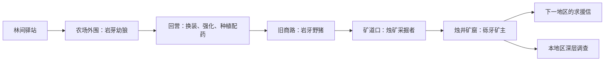
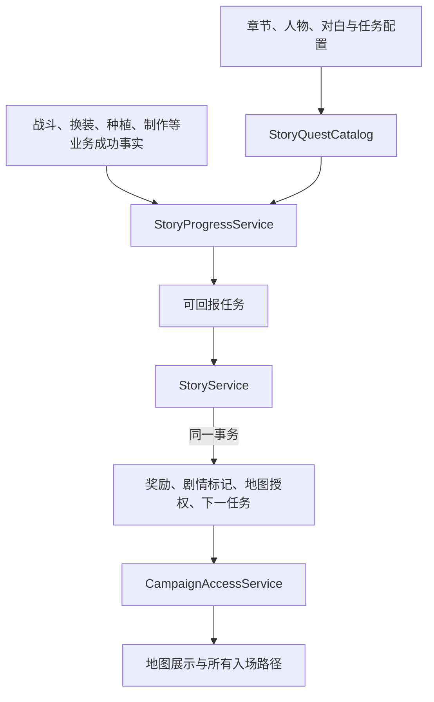

# 剧情主线、任务与地图解锁设计与实现

更新：2026-10-02。状态：第一章已实现；后续章节、独立支线及分支选择仍为设计。当前实现与验证范围见第12节。

本稿按用户明确的方向重写：玩家作为初来乍到的冒险者，通过人物委托进入第一场战斗，获得报酬，学习更新装备、种植和炼金；随后由剧情开启下一处战斗地点，逐步追查线索、挑战Boss。

原稿的“12个成长成就＋6个独立教学支线”及450金币／44碎片总预算不再作为实施依据。底层保留配置驱动、服务端判定和原子发奖思路，产品结构改为章节式冒险。

## 1. 核心体验

**遇见人物 → 得知问题 → 接下委托 → 战斗或整备 → 回报结果 → 获得报酬与新线索 → 开启下一地点。**

每个主要任务说明谁需要帮助、为何现在行动、做完发生什么，以及新线索将玩家带向哪里。主要任务的结果应改变可见路线、人物对白或剧情日志中的至少一项。

玩家起初只想赚到第一笔佣金，帮助营地后发现野兽异常与矿道开采有关；解决矿窟的问题，又发现异常并非只发生在一处。故事从身边的小事扩展到六地区的共同危机，不在开场堆出完整世界观。

营地、NPC、对白和“地脉异响”为本次新增设定。怪物、地区、副本名称沿用现有内容。新账号剧情从岩芽林地开始，旧账号保留原有地图访问。

## 2. 第一章：《林地传来的异响》

玩家随最后一辆货车抵达岩芽林地的“林间驿站”，在冒险者名册上登记。驿站近来接连遇到野兽袭扰、商路受阻和药品短缺。

首章先用三位反复出现的人物，让玩家逐渐认识他们。

| 人物 | 身份与性格 | 剧情职责 | 引导玩法 |
| --- | --- | --- | --- |
| 洛恩 | 驿站负责人，务实，关心出行者能否平安回来 | 发布巡查委托、确认线索、组织远征 | 接取、战斗、回报、下一地图 |
| 布兰 | 修理驿站工具的铁匠，直率，先看装备再说话 | 从战利品和金属痕迹中认出矿区来源 | 比较、替换武器与技能强化 |
| 米娅 | 照顾伤员、管理小药圃的药师 | 帮玩家建立补给来源，解释动物异常迁移 | 播种、炼金和携带补给 |

首版不需要可行走城镇。营地使用人物头像、短对白和按钮；地图节点通往现有战斗房间。

### 2.1 地图路线

“农场外围”“旧商路”“矿道口”是剧情节点的拟定名称，无需为它们先做新战斗或新敌人。

| 节点 | 当前战斗代码 | 当前战斗名称 | 当前推荐等级 |
| --- | --- | --- | --- |
| 农场外围 | `northshire-wolves` | 岩芽幼狼讨伐 | 1 |
| 旧商路 | `stone-tusk-boars` | 岩牙野猪讨伐 | 3 |
| 废弃矿道口 | `kobold-miners` | 烛矿采掘者讨伐 | 5 |
| 烛井矿窟 | `kobold-mine` | 烛井矿窟，Boss砾牙矿主 | 10 |
| 矿窟深处 | `kobold-mine-depths` | 烛井矿窟·深层，Boss沉岩督造者 | 10 |

上述等级来自当前配表，是难度建议，不是新增等级硬门槛。普通矿窟已有组队强度，“剧情开启入口”不代表新手此时一定打得过；首章可以跨多个挂机周期完成。

### 2.2 第一章12个任务

当前配表为 `Game.Server/story.json`。整章委托报酬合计190金币、T1武器碎片10枚、宁神花种子1颗和宁神花2株，不含原有战利品、首猎与首通奖励。地图授权不作为背包中的可出售道具。

| 编号／名称 | 剧情与人物 | 玩家行动 | 回报与推进 |
| --- | --- | --- | --- |
| Q01 无名的来客 | 洛恩登记身份：“这里没有轻松的活，但每份委托都有报酬。” | 完成首次营地对话 | 开启农场外围和第一份委托；沿用现有初始资产 |
| Q02 农场外的动静 | 幼狼闯进农场，洛恩请玩家保护货物 | 实际参与并通关岩芽幼狼讨伐1次 | 20金币、强化碎片2；发现狼群似乎被矿道的动静驱赶；原有首猎武器由战斗另行发放 |
| Q03 比练习武器好一些 | 布兰检查战利品，说明如何挑选装备 | 将首猎所得武器装入武器盘任意合法位置，并应用到角色 | 10金币；认识基础属性与武器技能，不强制换主手 |
| Q04 出发前磨一磨 | 布兰建议先打磨一把常用武器 | 任意武器技能达到Lv2 | 宁神花种子1；介绍米娅。所需2枚强化碎片已由Q02提供 |
| Q05 给下一次出征留些准备 | 米娅交出一小块药圃：“回来时，也许它们正好长成。” | 成功种下1块宁神花 | 米娅提供现成宁神花2株用于教学；作物仍正常生长4小时 |
| Q06 第一瓶备用药 | 米娅用晒好的草药教玩家备药 | 实际制作治疗药水1瓶，为同一执行角色装备并保有至少1瓶库存 | 10金币；收到商路巡查委托，开启岩牙野猪节点 |
| Q07 受惊的兽群 | 野猪似乎也在逃离原来的栖息地，商路因而受阻 | 实际参与并通关岩牙野猪讨伐1次 | 30金币、碎片2；在翻倒的运矿车旁发现异常矿石与矿工痕迹 |
| Q08 矿车上的印记 | 布兰认出印记来自停工已久的烛井矿窟 | 报告线索，一段短对话即可 | 开启废弃矿道口；不额外发物质奖励 |
| Q09 停工的矿道为何仍有灯火 | 洛恩请玩家确认矿工是否恢复开采 | 实际参与并通关烛矿采掘者讨伐1次 | 40金币、碎片2；获得剧情线索“采掘记录”，得知砾牙矿主在收集会引起震动的晶核 |
| Q10 矿窟里的敌人 | 洛恩提醒矿窟有连续守卫，布兰和米娅协助整备 | 主动保存1套合法编队，阅读简短远征提示 | 开启烛井矿窟；提示推荐等级、组队规模及回刷入口 |
| Q11 熄灭矿窟的灯 | 阻止砾牙矿主继续开采 | 实际参与并通关烛井矿窟，击败砾牙矿主 | 80金币、碎片4；当地暂时平静；保持原有普通本首通和深层资格规则 |
| Q12 来自远方的求援 | 洛恩收到来信：其他地区也出现相似异响 | 阅读章节收尾和下一章委托 | 第一章完成，开启下一地区路线；展示矿窟深层调查支线 |

关键教学形成资源闭环：Q03有首猎必得武器，Q04有强化碎片，Q05有种子，Q06有现成草药。不会要求先完成任务才能取得完成它所需的资源。玩家若提前出售、消耗了必需品，可通过已开放讨伐、商店和配方补充，不重复领取教学补给。

所有职业的新角色统一装备十把土属性「石纹短锤」，每把攻击90、生命110、生命小Lv1；已有角色装备保留。首猎的土属性「石刃手斧」可直接替换初始武器并激活同属性技能，所以Q03教替换而非补满十槽，跨属性配装留到后续教学。当前宁神花收获3株、治疗药水消耗2株，Q06只要求1瓶；不要求喝掉它，也不让玩家故意受伤。

矿车印记、采掘记录属于剧情日志，不占普通仓库，不会因玩家丢掉任务物品而卡住。Q08、Q12是短过渡，不做长距离往返跑腿。

### 2.3 首个委托的实际文案

**接取／洛恩：**

“你就是今天到的冒险者？来得正好。农场外有几只幼狼，昨夜咬破了货车上的粮袋。先替我赶走它们，报酬不会少你。别追进树林——你还不熟悉这里。”

**目标：**前往农场外围，通关岩芽幼狼讨伐1次。

**报酬：**20金币、T1武器强化碎片2。原有首次讨伐保底武器在战斗结算中显示，不在委托回报时再给一把。

**回报／洛恩：**

“干得不错。这是说好的报酬。它们以前很少靠近农场……你说矿道那边一直有敲击声？我会让人去查。先去找布兰，他能帮你看看带回来的武器。”

**下一步／布兰：**

“先把武器拿来。冒险者挣到的第一笔钱，最好花在能让自己活着回来的东西上。”

这一步同时完成首次战斗、有来由的报酬、装备教学的转场，以及矿道异常的伏笔。其他任务也按“委托理由—行动—结果—新问题”来写。

## 3. 后续章节与地区开放

区分两级地图：地区内的战斗节点，以及六个属性地区。地区内通过剧情依次开放三个讨伐和普通本；跨地区采用带少量分支的章节。

当前六地区都属T1，各有Lv1／3／5及10级内容。严格排成六个越来越难的大陆，会让后续低阶节点迅速失去挑战，需另做数值版本。本稿建议主线有先后，相邻章节提供两条调查路线，兼顾逐步开放和属性配装需求。

| 阶段 | 地区／章节名 | 冲突与线索 | 章节Boss |
| --- | --- | --- | --- |
| 第一章 | 岩芽林地《林地传来的异响》 | 野兽迁移、秘密采矿与异常晶核 | 砾牙矿主 |
| 第二章调查线之一 | 长风原野《失联的信使》 | 寻找信使、查清高巢封路、恢复消息往来 | 裂翎巢母 |
| 第二章调查线之二 | 雾凇雪境《不会融化的泉水》 | 泉水冻结、兽群异常与冰窟共鸣 | 凝牙狼王 |
| 第三章 | 赤烬荒原《地底的炉火》 | 线索指向运输晶核的熔岩裂隙 | 燧渊领主 |
| 第四章调查线之一 | 琉辉之森《失序的守庭者》 | 查阅旧庭档案、查明晶核用途 | 失序辉庭卫 |
| 第四章调查线之二 | 墨雾幽林《雾中的归路》 | 追踪失踪人员与另一批晶核 | 缄丝蛛后 |
| 后续深层调查 | 已通过普通本的地区 | 查明更深的共鸣源，进入现有深层路线 | 各区已有深层Boss |

第一章收尾同时开放长风和雪境的起始节点，玩家选择当前追踪路线，另一条保留。任意第二章线完成可进入第三章；第三章完成开放光／暗调查线。终章是否要求两条终段线索全部完成，留到完整剧情写作决定。

第一章及其收尾开放长风、雪境起始节点已实现；第二章以后的开放顺序仍为建议，尚未成为游戏规则。新账号目前只能沿已实现的第一章开放这7个节点，后续地区完整开放需要继续实现相应章节。已经超过地区强度的玩家允许快速推进，不反复要求刷十只低级怪；不能宣称现有六地区配表已支持六段递增难度。

各地区深层支线在其普通本通关后即可开始，不要求先完成六地区主线；仍沿用当前账号前置、角色精通和逐层解锁。Boss机制任务需真实机制成功事件支持，不把“释放过净化”当成成功解决机制。

## 4. 剧情、挂机和失败的节奏

- 每次主要推进都有报酬、装备变化、新线索或新地图。前期尽早让玩家体验至少一轮完整循环。
- 对白每屏少量句子，支持跳过和在日志重读；跳过文字不跳过战斗或制作目标。
- 一次突出一个主线目标，可另外追踪一个支线。任务完成只轻提示，不打断重复挂机。
- 新节点以一次有效首次通关推进，重复挂机负责经验与装备积累；不让每段故事都变成无理由的累计击杀。
- 解锁地点可以回刷，失败保留任务、线索和已开放路线；提供强化、补给、技能和组队入口。
- 第一块作物四小时后才成熟，实际收获放到支线《回营时的收成》；首次炼金用NPC给的现成草药。
- 普通矿窟当前为推荐10级的组队内容。不能强制购买五个角色位，允许初始角色与其他玩家协作或继续养成。若要保证新手单人通关，需独立设计故事难度，当前没有因为添加任务就自动获得该模式。

## 5. 账号剧情与角色执行

章节、剧情线索及地图授权归账号，新角色不重演来到营地。职业、装备、库存、药田、精通和Auto权限继续按角色独立。

Q01～Q06明确绑定教学执行角色，相关报酬发给同一角色，避免A打狼、B领草药却没有配方。制作并装备药水等复合目标要求同一角色满足。

允许主动更换执行角色：服务端验证归属、重验当前未完成步骤；已领物品不复制、不自动转移。新角色没有种植／配方资格时，提示它到已开放农场取得自己的基础击杀记录；缺耗材可回刷和购买。删除执行角色后走同一替换流程，账号故事不重置。

后续战斗主线可以由任一自有有效参战角色推进。同场三个自有角色算账号一次通关；其他账号不能替未参战账号完成任务。治疗、坦克、实际参战后阵亡者沿用现行认定，胜利后才加入者不计本场。

任务完成不能替其他角色授予Auto、精通或角色配方。剧情只呈现实际解锁结果，最终权限仍由对应业务规则判定。

## 6. 回报与地图解锁

剧情状态为`Locked → Active → ReadyToTurnIn → TurnedIn`。目标满足后显示“向洛恩回报”；玩家点击“领取报酬／继续”，服务端在同一事务发奖、设置剧情标记、开放地图、激活下一任务。

回报是故事转场的一部分，但不需要手动回城跑图，也不重复要求“交完再接一次”。跳过对白可以快速走完转场，不能跳过任务目标。

分别记录地点已发现、地点可挑战、地点已通关、对应剧情已回报。玩家能看见远处地点的剪影和锁定原因；后台使用账号授权，不能只靠前端隐藏入口。

首猎武器与普通／深层首通奖励继续由原系统发放。任务页分别显示“战利品”和“委托报酬”。Q11实际通关继续按现有规则产生深层资格，回报负责解释及展示支线，不额外撤回已经满足的深层资格。

## 7. 架构：任务、对白、章节、地图授权

### 配置

- `StoryChapterDefinition`：章节代码、名称、起始任务与终止节点。
- `StoryNpcDefinition`：人物代码、名称和简介。
- 对白暂内嵌于任务的 `StartDialogue`／`TurnInDialogue`；首版不做复杂结局分支或独立对白状态机。
- `StoryQuestDefinition`：代码、版本、章节、发布／回报NPC、对白、执行角色规则、目标、奖励、完成效果和下一任务。
- `StoryMapNodeDefinition`：节点代码、地区、真实副本代码、前置任务和说明；推荐等级读取世界配置。节点代码须等于真实副本代码，启动时校验。

完成效果使用服务端固定白名单：发奖励、设置故事标记、解锁节点、激活任务、完成章节。不能让前端传任意奖励或脚本。

首个战斗任务的配置语义示例：

| 字段 | 示例 |
| --- | --- |
| Code | `ch01-02` |
| ChapterCode | `ch01` |
| Scope／ActorPolicy | Account／TutorialCharacter |
| StartNpc／TurnInNpc | 洛恩／洛恩 |
| Objective | 激活后有效通关`northshire-wolves`一次 |
| Rewards | 金币20、`weapon-fragment-t1`×2 |
| OnTurnIn | 记录`ch01-02`已回报，激活`ch01-03` |

实际字段与完整对白见 `Game.Server/story.json`；任务激活时保存定义快照，后续改表不会追改已激活实例的报酬。

### 服务

| 服务 | 职责 |
| --- | --- |
| `StoryQuestCatalog` | 编译配置，检查引用、前置可达性、奖励和版本 |
| `StoryProgressService` | 根据业务成功事件及实际装备状态更新当前目标，不自行提交外层事务 |
| `StoryService` | 初始化、执行角色切换，以及原子提交报酬、故事标记、地图授权与后续；查询方法只读 |
| `CampaignAccessService` | 判定账号能否访问地图，返回明确未开放原因 |

沿用当前单机EF Core／SQLite事务边界，无需额外消息队列。业务与进度一起保存，提交成功后才通知客户端。剧情必须有独立代码和状态，不能只是一段任务描述。

## 8. 存档与计数

本次新增以下5张表，任务目标进度合并在实例内，剧情标记保存在账号状态的JSON字段：

| 记录 | 内容与约束 |
| --- | --- |
| `UserStoryState` | 当前追踪章节／任务、教学执行角色、版本；按账号唯一 |
| `StoryQuestProgress` | 任务代码、定义快照、激活时间、执行角色、状态、进度、版本；账号永久任务唯一，定义Revision不改变领取身份 |
| `StoryMapUnlock` | 用户＋节点代码唯一；保存授权来源与时间 |
| `StoryActionReceipt` | 用户＋请求标识唯一；领取记录另约束用户＋任务唯一，保存指纹、接收角色及奖励／效果快照；重试别名和切换角色凭证不占任务领取键 |
| `StoryEventReceipt` | 用户＋任务＋稳定业务事件标识唯一，防重复累计 |

首版对白是一段短文，重进时从当前任务恢复，已完成任务可在日志重读；不持久化逐句阅读位置。客户端不能直接写任意剧情标记。

目标明确区分三种统计策略：

1. **当前满足即可**：装备、强化等级等；激活时检查已有状态，不要求先卸下再穿上。编队教学要求主动保存，排除系统自动补齐。
2. **从激活开始累计**：本次委托的通关、播种、制作；玩家接到该阶段后由后台业务事实统计。
3. **可靠历史回补**：永久通关／精通及老存档迁移；明确定义适用目标，不一次性完成所有未来剧情。

前置交付时立即激活下一任务，不能等用户打开任务页才计数。新激活的状态目标做一次快照判定，累计目标保存激活边界。已满足条件锁存，后来换装不抹去完成结果。

战斗按有效参战与场次计数；种植按成功地块；制作按实际成功批次及产出。任务赠草不算收获，获得药水不算制作，不解析中文战报作为证据。

关闭页面后，既有合资格活动照常推进并更新目标；可进入待回报状态，但不自动播放剧情或替玩家领取报酬。

## 9. 与当前实现的衔接

当前`IsVisible`是全局可见性，不能当成账号解锁。地图响应增加已发现、可进入、锁定原因和前置任务等账号视图信息。

地图权限须覆盖创建房间、加入房间、编入角色、预约执行及其他实际入场路径，同时保留归属、占用、版本和深层资格检查。房间分享或直接调用API不能绕过剧情前置；各账号分别检查，已开放账号不能把未开放账号带入。

当前普通本与深层本都可能为`DungeonKind = Dungeon`，剧情目标需绑定副本代码或正式深层目录映射，不能只凭DungeonKind区分。

接入位置：

- `DungeonRunService`／`BattleMilestoneService`：已去重成功的战斗事实，沿用真实参战名单。
- `WeaponService`及仓库路径：成功换装、强化后重验状态目标。
- `PlantingService`：成功播种。收获支线留待后续内容实现。
- `ProductionService.AdvanceCoreAsync`：统一实际制作结算，包含后台与补结算。
- `FormationService`：玩家主动保存成功；排除`FormationBackfillService`自动生成。
- `CharacterLifecycleService`：初始化故事、处理教学角色删除和接替。

回报事务：校验归属与已有凭证 → 验证当前节点、目标、执行角色 → 固定服务端时间并补结算既有生产 → 发报酬 → 写故事标记及地图授权 → 激活下一任务／完成章节 → 写凭证并提交。

先结算生产再发草药，防止新材料被用于过去周期。连点、换请求标识、并发和断线重发不能重复领取；任一步失败全部回滚。提交后显示收尾与新地图提示，断线重进可以从凭证恢复。

角色战斗中可回报，但不改变本场冻结配装。首版任务奖励只做金币、强化碎片、基础种子／草药，不额外引入经验分配、角色位或高级装备选择器。

## 10. 界面与接口

大厅突出“当前章节＋当前主线”，节点地图展示已到达地点和下一目标。基础角色与仓库能力保留可用，相关入口随教学逐步突出。

主线卡示例：

> 第一章 · 林地传来的异响  
> **农场外的动静**  
> 洛恩希望你清理农场外的幼狼，让货车能够继续卸货。  
> 岩芽幼狼讨伐：0／1  
> 报酬：20金币、T1武器碎片×2  
> 执行角色：当前教学角色  
> 【前往农场外围】

达标后按钮变为“向洛恩回报”。对话面板展示结果与报酬，一个“领取报酬／继续”动作完成交接并展示后续人物。营地头像只标记当前有关委托，不展示所有未来任务红点；战斗内仅放简短追踪。

已实现接口：`GET /api/story`、`GET /api/story/map`、`POST /api/story/initialize`、`POST /api/story/quests/{code}/turn-in`、`PUT /api/story/tutorial-character`。GET不初始化、不发奖；进入冒险日志时显式初始化。回报传请求标识和任务版本，切换执行角色传请求标识和账号故事版本。目标奖励与接收角色按服务端实例规则确定。对白跳过仅改变显示，不提供任意设置剧情标记接口。

## 11. 老存档与验收

新账号从序章进入解锁链。迁移 `20261002050000_AddStoryCampaign` 为已有账号创建 `IsLegacy=true` 的故事状态，保留原有地图访问及深层资格要求。旧账号可逐条回顾全章，每个节点直接待回报，无须重打或补做教学。

旧账号回顾不发放本次新增委托报酬，也不重复发原有首通奖励。回顾状态不伪造业务历史。没有故事状态的导入账号走同一兼容路径；正常注册必须创建非Legacy状态，不能借初始化绕过剧情地图限制。

验证重点：教学资源可达；跳过对白不跳目标；领取后下一任务立即计数；首猎武器不重复；种植等待不卡主线；发材料不倒灌旧生产；地图授权与报酬一起提交；加入／编入／预约不能绕过前置；副角色共享地图但不共享精通；重启恢复待回报；重复回报不重复发奖或初始化下一任务；教学角色删除能接替；Boss失败保留进度；旧账号地图访问不倒退。

## 12. 当前交付与验证

已交付第一章12个节点、3位NPC对白、7个地图节点、服务端进度判定与回报、账号地图权限、旧账号回顾和客户端“更多 → 冒险日志”（`/story`）。房间大厅显示当前主线追踪。配置驱动的框架可继续扩展目标和内容，但跨章节选择、第二章以后剧情、独立深层调查任务及收获支线尚未实现；当前深层入口沿用原有业务玩法。

Q03、Q06以角色实际配装为准。在编队编辑器保存预设后须应用到角色，仍在房间中的角色须先离场再应用。保存预设本身不会完成换装教学。Q10则有意要求主动保存一次合法编队。

本轮验证结果（2026-10-02）：

- 剧情专项40项全部通过：配置与迁移10项、地图入口10项、业务事件6项、整章与存档7项、真实多连接并发2项、客户端剧情请求归属5项。包含重复请求、换请求标识、两客户端同时回报、事务回滚、教学角色接替与旧账号回顾。
- 全量服务端测试1720项：1705通过、15失败、0跳过。失败集中在现有 `AlchemyCombatTests` 的9项药剂伤害与5项增益时长断言，以及 `FirstHuntBalanceTests` 的1项治疗药掉落断言。当前工作区已经下调药剂加成、将增益改为6回合并关闭战斗药剂掉落，旧断言仍要求原值；本次未改写这些平衡测试或数值。
- 客户端构建0警告、0错误；请求上下文与缓存测试53项通过，其中包含上述5项剧情请求测试。
- 浏览器320／390／1280宽度无横向溢出、无页面错误；验证首个对话实际回报、安全重试、日志与地图入口。后续教学页面验证使用隔离账号及指定任务状态，未把这些检查视为从零完整打通Boss。
- Q03与Q06另外验证真实“保存编队 → 应用 → 查询剧情”HTTP链路：仅保存仍为Active，应用后ReadyToTurnIn。前置战利品和制作进度在隔离数据库准备，没有修改玩家存档。

迁移已在临时数据库验证升级、回退重放、与当前模型一致。本轮未更新运行中服务器或正式存档；正常服务启动沿用现有数据库迁移流程。全量结果保存在 `artifacts/story-validation/story-full-suite.trx`，浏览器证据保存在 `.codex-tmp/story-ui-eb34c2de62ab4e2d93d56d65145da068/`；它们是本地验证产物，不属于正式资源。

后续内容应先补齐第二章及其完整开图链，再调整跨章节分支；新增目标时把事件接在对应业务成功事务内，避免读页面触发计数。修改已激活任务的结构或移除后继代码时，需要显式迁移旧快照，不能仅删除配置。

## 核对入口

- [当前世界与战斗名称](../Game.Server/world.json)
- [当前种植、制作、奖励配表](../Game.Server/appsettings.json)
- [房间入口与地图列表](../Game.Server/Services/RoomService.cs)
- [有效参战与副本结算](../Game.Server/Services/DungeonRunService.cs)
- [深层资格与精通](../Game.Server/Services/DungeonDepthProgressService.cs)
- [药田服务](../Game.Server/Services/PlantingService.cs)
- [生产结算](../Game.Server/Services/ProductionService.cs)
- [编队服务](../Game.Server/Services/FormationService.cs)
