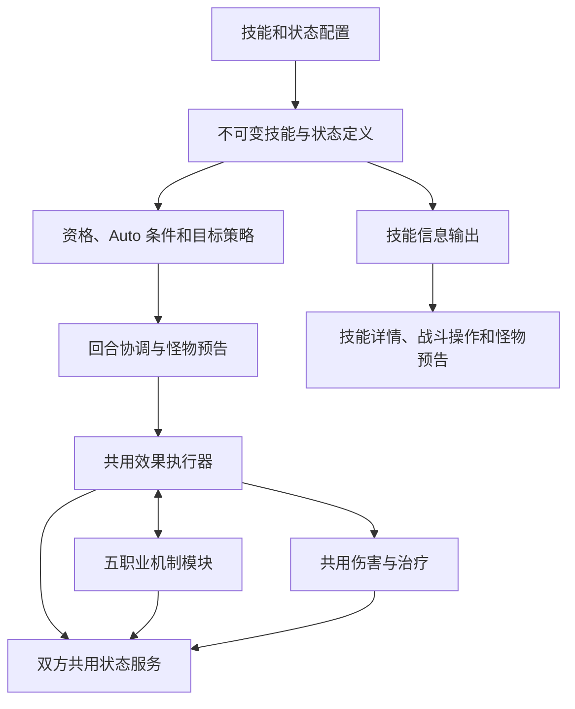

# 角色与怪物技能系统重构

本任务建立可扩展的角色与怪物技能系统，为后续副本机制设计提供基础。角色特殊机制必须由正式战斗状态驱动，并在角色 Buff 栏展示真实的层数、次数、强度和有效期；敌人承受的效果在怪物状态栏展示。

实施以当前实际结算行为为基线。新增玩法和数值平衡另行设计；每阶段须保持既有职业循环、存档、房间并发和奖励保存规则。

## 当前行为基线

- 五个战斗职业各有五个本职技能。技能在职业等级 1、3、5、7、10 解锁；Lv2 在 12、14、16、18、20 解锁，Lv3 在 22、24、26、28、30 解锁。骑士沿用 `swordsman` 存档代码。
- 来源职业达到 30 级开放一个共享技能；当前职业达到 10 级可装备一个外职业共享技能。共享版独立于本职循环。
- 当前回合先处理操作药和战斗增益、魂印、技能，再处理普通攻击、补给、怪物行动和回合末状态。技能阶段先执行全队手动排队，再执行全队 Auto；各阶段保持角色站位和技能槽顺序。
- 第零回合检查初始冷却；施放后就绪回合为 `当前回合 + 常规冷却 + 1`。同技能每回合最多施放一次，无有效效果不进入冷却。
- Auto 依赖账号开关、角色通关资格、技能设置、冷却和当前动态条件。手动施放独立于 Auto。
- 普通守护当回合有效，同目标取较强项；反击资格属于实际提供保护的角色。
- 持续伤害和持续治疗首次从后续回合结算。刷新既有持续效果不推迟已到期的伤害或治疗；延长持续时间不缩短已有剩余时间。法师灼烧使用新攻击快照，其余现有周期效果保留较强快照。
- 新一轮挑战清空战斗状态；波次切换保留角色未到期状态，清理旧怪物状态和绑定该怪物的角色资源。
- 重构前服务端测试基线为 776 项通过。

## 状态归属与生命周期

| 机制 | 拥有者及展示 | 生命周期与消费 |
| --- | --- | --- |
| 影之蓄势 | 盗贼 Buff | 最多三层，斩击消耗，挑战结束清空 |
| 恩泽和辉光 | 祭司 Buff | 下一次符合条件的本职效果消费，可跨波 |
| 神启 | 祭司 Buff | 显示剩余本职强化次数，可跨波 |
| 失序 | 法师 Buff，绑定当前怪物 | 每三层触发回响，当前怪物死亡清空 |
| 奥术领域和持续驱散 | 法师 Buff | 各自按回合及触发时点失效 |
| 猎物锁定 | 猎人 Buff，绑定当前怪物 | 按回合、技能消费或目标死亡清空 |
| 鹰眼时刻 | 猎人 Buff | 显示剩余保留标记次数与回合 |
| 协猎与肾上腺素 | 受益角色 Buff | 展示追击或二连击加成及回合 |
| 守护及反击资格 | 受保护角色 Buff | 本回合，记录提供保护的角色 |
| 破绽及奥术扰乱 | 怪物状态 | 全伤害易伤或下一次伤害性技能消费 |
| 中毒灼烧和持续恢复 | 实际受益或受害单位 | 保存施放时快照与周期持续时间 |

状态实例分别保存施加来源、技能来源、拥有者、绑定目标、快照与计数。持续时间、消费时点、叠加家族和快照刷新方式由状态定义表达。`PerTickValue` 只用于真实的周期数值。

## 实施与验收清单

- [x] 固化全部角色技能版本、共享技能和怪物技能配置与预告规则的基线。
- [x] 统一技能定义与运行时版本解析，完善所有版本的参数和引用校验。
- [x] 建立角色和怪物共用状态服务及状态归属迁移。
- [x] 将职业资源及强化状态在角色 Buff 栏准确展示。
- [x] 将守护和等待触发的反击资格迁入正式状态。
- [x] 统一目标选择、施放资格、Auto 条件和不可用原因。
- [x] 抽离通用效果执行器和五职业机制模块。
- [x] 统一适用的伤害与治疗来源规则，保留怪物预告和打断。
- [x] 统一技能详情、战斗技能栏和怪物预告的效果说明。
- [x] 用结构化战斗事件驱动反馈与结算过程中的 Buff 展示。
- [x] 整理配置和遗留运行时逻辑，更新现有文档。
- [x] 验证存档升级、并发保存、完整服务端回归与客户端构建。

## 状态基础阶段的交付

`BattleStatusCatalog` 和 `BattleStatusService` 统一管理双方状态定义、应用、消费、净化、属性修正、周期结算及状态说明。状态操作仍由回合统一提交，支持同回合内尚未保存的新增、消费和刷新结果。

失序与猎物标记改用独立的绑定目标字段，并在所属角色 Buff 栏展示。强化次数与叠层分别显示；生命周期和目标名称由服务端提供。周期快照保留较强值时也保留实际来源，法师灼烧按配置采用新快照。

新增迁移将旧状态中存入 `PerTickValue` 的怪物编号转到绑定字段，保留真实周期数值；回退时还原旧绑定格式。六项新增回归覆盖同回合消费和重新获得、保存后恢复、绑定目标清理、当前回合失效、两种快照刷新策略与迁移往返。

本阶段完整服务端回归 782 项通过；客户端构建通过，零警告、零错误。状态展示的验证包括服务端状态响应与客户端编译，浏览器视觉验收留到整体交互调整阶段。

状态基础阶段尚未包含职业执行模块、共用效果执行器和结构化反馈；后续交付见下文。完整目标保持上方清单的范围。

## 技能定义、施放规则与守护阶段的交付

运行时使用不可变的 `BattleSkillDefinition` 和 `BattleSkillEffect`。角色版本明确携带等级、来源职业和共享标记；怪物版本将伤害与状态转换为同一组效果，保留预告目标、可打断性、危险等级、强制优先级与触发条件。配置变更和兼容接口返回值的修改不能改变已经编译的运行时定义。

等级版本继续独立覆盖基础配置；共享版先应用 Lv3，再应用共享覆盖。缺失来源职业记录不再能够通过共享技能资格判断。各版本均在启动时检查状态引用、条件伤害、目标、效果、冷却和空效果列表。

`SkillBehaviorBaseline.json` 固化 75 个本职等级版本、5 个共享版本和 60 个生产怪物技能。测试同时检查各解锁边界、数值、效果顺序和怪物预告规则；已有副本深度测试继续覆盖三种占位技能及逐层加载。

`SkillBattlePolicy` 统一队友目标、有效效果、Auto 条件和不可用原因。排队时与执行时分别读取当前快照；执行前重新检查，不把排队时的血量或状态当成最终结果。房间响应提供可用性、目标选择能力和允许的目标编号，客户端据此显示和禁用操作。冷却缩减资格只考虑其他伤害技能，与实际结算一致。

`BattleGuardService` 将减伤、保护者、受保护角色的反击许可和保护者待反击次数保存为正式状态。数值快照使用独立的 `MagnitudeSnapshot`，保留实际技能来源；同强度保留原来源，较强项覆盖，最高减伤为 75%。受击消费许可，群体攻击为同一保护者产生一次待反击状态，在怪物行动后消费。当前回合结束即清理，不延长至下一回合；结算过程中的状态展示将结合下一阶段的结构化事件完成。

本阶段新增验证覆盖全部定义基线、可变配置隔离、错误版本、来源等级缺失、目标与 Auto 一致性、房间可用性刷新、守护来源与强度覆盖、保存后恢复和一次性反击。完整服务端回归已通过 798 项，之后的空效果校验补充通过 8 项定向验证，冷却缩减资格新增验证 1 项通过；客户端最终构建通过，零警告、零错误。

## 共用执行、职业模块与技能信息阶段的交付

`BattleEffectExecutor` 按定义顺序执行伤害、治疗、守护、净化、驱散、打断、状态附加和角色伤害技能冷却缩减。`BattleExecutionContext` 提供双方单位、队伍、元素、操作药与预告打断入口；`BattleSkillResult` 记录有序效果结果，分别保留计算伤害和实际生命损失，区分治疗、净化及其他成功效果。无有效效果的角色技能仍不进入冷却。

`BattleService` 保留回合协调、施放资格、排队次序和冷却保存。骑士、祭司、盗贼、猎人、法师的施放前后规则分别位于五个机制模块。影之蓄势、恩泽、辉光、神启、失序、猎物标记和鹰眼由共用状态服务添加或消费。法师“一回合最多一次回响”也保存为本回合状态，在保存或重新创建服务后仍有效。骑士守护反击在怪物行动全部效果结束后执行一次。



`BattleDamageService` 统一角色与怪物的直接伤害计算，并用于普攻、职业技能、魂印、法师回响和骑士反击。来源明确区分普攻、技能、职业触发与历史招架：普攻和技能暴击概率、操作药加成、魂印元素、施放时血量、职业强化倍率及追击规则保留原语义。职业治疗使用施放者与受益者的治疗加成，魂印和周期恢复保留各自既有规则；恢复生命时共用存活与上限检查。追击直接使用已结算伤害，避免再次经过易伤、元素等倍率。

状态定义新增明确的机制等级、机制强度、初始计数及家族刷新策略。扰乱强度、领域等级、鹰眼次数和协猎加成不再从状态代码的后缀推算。家族可以保留较强状态或替换旧项；强度比较使用已保存的快照。状态定义在启动时编译为不可变对象。

怪物服务负责选择及保存预告、初始与常规冷却、打断和房间状态清理，不再承担角色职业资源管理。怪物直接伤害、状态及新增组合效果进入同一执行器。双方共用 `BattleParticipant`，移除了传入独立守护字典的旧入口，测试也直接建立正式守护状态。

怪物配置可以继续使用既有 `DamagePowerPercent` 和 `Statuses`，也可以使用有顺序的 `Effects`。同一技能不能混用两种形式。效果列表支持伤害、自疗、当前回合守护、自身净化、敌方增益驱散和双方状态附加；初始冷却可以单独配置。敌方效果目标必须与预告一致，自身效果可以包含在同一行动中；启动校验拒绝空列表、无效倍率、未知状态、矛盾预告及不支持的效果。既有 60 个怪物技能仍由原配置编译，冻结的行为基线未变。

例如，一个预告全体攻击且包含自疗的怪物技能可按以下顺序配置：

```json
{
  "Code": "boss-recover-and-strike",
  "Name": "恢复与横扫",
  "Description": "先恢复自身生命，再攻击全体角色。",
  "TargetType": "AllAlive",
  "InitialCooldownRounds": 2,
  "CooldownRounds": 3,
  "Effects": [
    { "Type": "Heal", "Target": "Self", "HealMaxHpPercent": 10 },
    { "Type": "Damage", "Target": "AllAlive", "AttackPowerPercent": 120 }
  ]
}
```

怪物的持续伤害可保存施放时攻击快照，持续自我恢复可保存自身最大生命值快照；首次均从后续回合结算。普通守护只在当前回合生效，跨回合减伤通过有持续时间的状态表达。

`SkillInformationService` 从编译后的技能及状态定义统一生成效果说明、状态名称和属性。职业配置界面、战斗技能栏、怪物预告使用同一输出；客户端已删除肾上腺素倍率和状态名称的独立映射。说明分别表达本回合有效、后续回合、消费次数及周期效果的首次生效时点。

旧技能天赋行为暂时集中在 `LegacySkillTalentAdapter` 和 `LegacyMonsterDefenseAdapter`，保证历史测试及存档分支的行为仍可辨认；其是否继续保留、旧节点数据和过期说明的处理列入清理阶段。

本阶段新增验证覆盖怪物组合效果顺序、预告一致性、初始冷却、纯固定伤害、实际伤害与过量伤害的区别、死目标状态跳过、回响次数保存与服务重建、任意状态代码下的明确机制参数、计数刷新、双方周期快照、共用依赖实例及技能说明一致性。最终完整服务端回归 816 项通过，包含存档迁移、并发与奖励保存的现有验证；客户端构建通过，零警告、零错误。新增代码和修改内容的格式检查通过。共享守护技能另有回归保证：其他职业不能因使用骑士来源的守护效果而获得骑士反击资格。技能详情、预告与动态 Buff 播放的浏览器视觉验收留在整体阶段。

## 结构化反馈阶段的交付

`BattleEventCollector` 在当前结算中记录不可变事实，`BattleLogStore` 仅在数据库保存成功后原子发布战报和事件。事件包含房间、挑战、完成回合、原怪物编号、结算版本、顺序及独立编号；伤害和治疗区分计算量、实际量及当时的 HP 上限与结果。动作明确区分技能、普攻、魂印、反击、追击、周期和药剂。

状态事件保存完整快照，包括定义语义、来源、绑定目标、强度、周期值、层数／次数和有效期；添加、刷新、消费、移除、到期、保留较强状态分别标记。操作不会独立保存。长结算超过历史预算时完整保留，成功响应和房间历史使用相同事件编号，房间响应过滤尚未匹配房间版本的事件。并发失败不会发布任何反馈。

`BattleFeedbackPlanner` 已删除正则与中文日志解析，也不再用 HP 差值捏造攻击。播放按角色及怪物编号定位，使用事件的实际量、暴击、元素和动作类型；击败后换到同名怪物仍针对原怪物播放。Buff 栏从初始快照依次应用每个状态事件，展示获得后同轮消费的状态和计数；动画使用独立临时容器，结束或取消时恢复页面显示。技能动画不会由技能名称推断。

药剂保留库存、次数和冷却专用存储，通过 `BattleConsumableStatus` 输出同一状态快照和反馈接口。真实浏览器检查使用生产播放脚本及生成的页面样式，覆盖计数 3 → 2 → 移除、敌方驱散、元素技能与实际生命上限、结束同步、取消清理与安全文字渲染。检查源在 `Game.Server.Tests/Client/battle-combat.test.cjs`，需 Node.js、Playwright 和可用浏览器；Windows 默认使用已安装 Edge，可通过 `PLAYWRIGHT_CHANNEL` 指定。运行前先构建客户端生成页面样式，再执行 `node --test Game.Server.Tests/Client/battle-combat.test.cjs`。

本阶段服务端回归 817 项通过，客户端构建零警告、零错误，3 项浏览器播放验证通过。后续清理又加入旧追击、原生守护反击和挑战结束状态验证，最终结果记录在下节。

## 遗留兼容与整体验收

旧战斗天赋树已退休，当前技能不以旧节点作为学习条件。历史节点记录保留数值兼容，集中在 `LegacyBattleTalentService`、`LegacySkillTalentAdapter`、`LegacyMonsterDefenseAdapter`；新技能不依赖这些接口。旧节奏／截击／守护追击使用正式 `NormalAttackEcho` 状态，保存来源、强度快照、剩余一次和回合期限，遵守既有后续回合消费条件。兼容配表只保留不可变数值，不暴露可变节点对象。胜利恢复与冷却也通过统一事件输出。

状态服务提供挑战结束清理，胜利、战败及关闭房间不会残留可跨挑战的 Buff；换怪物继续只清理绑定旧目标的状态。README 已改为当前职业成长、共享、顺序、冷却、状态和配置规则，移除过期战斗天赋树及转职接口说明。

最终完整服务端回归 821 项通过，覆盖全部技能基线、存档迁移往返、模型一致性、房间并发失败不发布反馈、奖励保存及挑战结束状态清理。客户端最终构建通过，零警告、零错误；3 项浏览器播放验证全部通过。

实际页面验收使用隔离的临时数据库，经过真实启动迁移、注册、创建角色、技能排队与服务端回合结算。桌面和 390 像素手机宽度均检查技能详情、展开的怪物效果预告、角色 Buff 详情和播放过程；法师失序始终出现在所属角色栏，消费及来源、目标绑定说明正确。怪物预告效果分行展示，页面无横向溢出，检查期间无浏览器脚本错误。

战报与结构化事件使用进程内的有限历史缓存；服务重启后不会恢复此前的播放历史。数据库中的房间、生命、冷却和状态仍是权威结果，重新加载页面按当前结果显示。需要跨服务实例共享或长期回放时，可在发布边界增加持久化事件存储；当前副本技能配置和状态结算不依赖历史缓存。

## 多目标效果与回合状态读取优化

群体驱散按每个存活目标移除一个可驱散增益，并为每个实际移除生成独立结果和事件。执行器中的群体净化使用相同规则；`FirstDebuffedAlly` 仍按目标顺序找到首个具有可移除负面状态的队友，只移除一个状态。没有符合条件的状态、不可驱散状态及死亡目标会跳过。角色配置当前允许的目标类型保持原有校验规则。

`BattleStatusService.BeginSettlementAsync` 在实际回合入口一次加载本房间、本次挑战的状态，包括需要原位刷新的过期行。作用域内的状态查询、应用、刷新、消费、周期结算及挑战清理使用同一批已跟踪实体，新增状态立即合并可见。已持久化但本轮标记删除的状态可在保存前重新获得；新增后又移除的状态不会被误当成数据库旧行复活。

结算作用域覆盖最终保存和反馈发布，成功、并发失败及异常退出均释放。不同房间或挑战的读取走独立查询，禁止嵌套或重叠作用域，初始加载失败可重试。换怪物的 `RemoveBoundToAsync` 保持清理该房间全部挑战中关联状态的既有语义，因此保留一次单独查询；这里优化的是逐效果、逐命中的重复读取。

怪物 `Guard` 明确为本回合守护，能够影响当轮反击，回合末失效。需要抵挡下一轮玩家攻击时，应配置有持续回合的 `ReductionPercent` 状态。本次不改变现有守护期限或职业数值。

固定版本的浏览器依赖和统一验证入口见 [战斗验证](combat-validation.md)。`tools/verify-combat.ps1` 依次运行服务端测试、客户端构建和浏览器播放测试，任一步失败即停止并返回非零退出码。

本轮完整验证为 833 项服务端测试全部通过、零失败及零跳过；客户端构建零警告、零错误；3 项浏览器播放测试全部通过。相较上一阶段新增 12 项回归，包含多人状态移除范围、状态作用域生命周期与异常恢复，以及实际回合入口的查询预算。在无技能的普通攻击场景中，1 人和 5 人各结算一轮，对 `BattleStatusEffects` 的 SELECT 均为 1 次，且实际生命值和事件结果一致；这一指标仅计算状态表读取，不代表整轮只有一次数据库访问。

## 后续战斗重构目标（2026-09-30）

本目标在 833 项回归的基础上继续推进，按以下职责边界维护：

| 层次 | 职责 |
| --- | --- |
| `BattleService` | 身份与准备、自动推进、重复挑战、波次与奖励、版本冲突、统一保存和成功后发布 |
| `BattleRoundExecutor` | 操作药、临时增益、魂印、手动与 Auto 技能、普攻、敌方行动、周期效果和胜利天赋的既有顺序 |
| `BattleEffectExecutor` / `BattleDamageService` | 有序效果、统一命中结算和职业钩子 |
| `BattleStatusService` | 当前结算共享状态、归属与生命周期、状态事件 |

回合执行器计算已跟踪实体并返回继续、敌方败退或队伍败退结果，不自行保存、换怪、发奖或设置房间倒计时。状态和事件作用域由外层持有，覆盖计算、奖励/换怪及一次提交。玩家阶段击杀只完成周期治疗；敌方行动中反击或周期伤害击杀也进入同一个换怪/奖励出口。药剂结束反馈与守护清理仍发生在决定房间结果之后、回合号推进之前。新增独立连接验证保证计算阶段不会提前持久化生命、药剂状态或房间进度。

`ProfessionMechanicCatalog` 集中五职业额外参数；已配置在技能与状态中的倍率、期限和资源上限继续由原定义负责。机制执行、可用性快照和生成说明共用这一目录。动态状态优先使用明确绑定，未绑定的自定义代码只允许唯一机制与强度匹配，避免本职/共享破绽受配置顺序影响。生产启动验证技能绑定、状态变体、期限、计数方式与容量；部分配置的单元测试保留可选状态的兼容入口。

`BattleRoundTrace` 将角色身份规范化为槽位、怪物为波次与位置，保留有序事件、生命、状态和冷却，排除日期、数据库编号、全局事件编号与展示文案。模拟器沿用既有种子随机数和源码哈希，并输出战斗指纹；完整轨迹用于定位首个分歧。测试比较独立数据库、同种子重复运行和跨波次重建服务；这是行为验证，既有技能定义基线仍单独保留。

反馈使用房间、挑战和完成回合识别同一次结算；客户端可补播晚到事实、拒收版本倒退响应，关闭房间最多追加三次获取。日志增加进程 epoch，服务重启后新日志不会因编号重置被吞掉。缓存限制为最多 256 房间和最后发布后两小时，在访问时清理，保留完整最新结算。当前部署配置是 SQLite 与单进程 worker，未引入持久化事件队列；进程在提交后、发布前崩溃时仍可能丢失那次播放历史，数据库战斗结果不受影响。需要多实例共享、崩溃窗口补发或长期回放时，再把事件写入同一数据库事务并加入 outbox。

验证入口同时构建平衡模拟器，避免模拟工具再次随生产接口演进失效。模拟器已适配当前本职技能、矿井兑换来源及精英多武器配置；每份报告记录实际技能和武器预设，旧人才/转职模拟报告不能当成相同输入直接比较。使用方法和固定轨迹更新流程见 [模拟器说明](../tools/Game.BalanceSimulator/README.md)。

本目标已完成，最终验收（2026-09-30）：

- `tools/verify-combat.ps1` 全流程通过：866 项服务端测试，零失败、零跳过，比上一阶段增加 33 项；平衡模拟器和客户端 Debug 构建均零警告、零错误；3 项真实浏览器播放测试通过。
- 独立数据库、同种子重复运行、逐轮重建服务及跨波次行为，与保存的六轮完整轨迹一致。普通场景的 10 组样例各重复两次，完整轨迹及指纹相等，运行期间源码未变。
- 五人四波副本重复两次，均 7 回合胜利，波次序列为 `1,2,2,3,3,4,4`，完整轨迹相等；战斗指纹为 `2FD50956DD3DD2807E71BCAF71C756CC7A332466B831260F76EDA07E8F234912`。
- 使用全新临时数据库完成真实服务迁移和启动；职业接口返回五职业，战斗/房间依赖解析成功。测试进程已关闭，未使用现有游戏数据库。
- 对照拆分前代码检查结算顺序，未发现额外玩法变更；工作区差异与新增文件格式检查通过。

上述验证确认当前覆盖场景的行为与兼容性，不代表所有技能组合均已穷尽。后续新增职业或副本机制，应同时维护边界用例、固定轨迹及实际配置校验。

## 验收依据

- 结构化事件必须携带回合、来源和目标编号、技能来源、动作类型、计算量及实际量、暴击、元素以及当时的状态快照。Buff 添加、刷新、消费和失效需要明确区分，不能靠回合最终状态猜测此前发生的变化。
- 事件与房间变更一同进入结算结果，保存成功后才发布。失败或并发冲突不能产生已展示的伤害、状态或重复反馈；单次长技能链须完整保留。
- 客户端依据事件播放伤害、治疗、打断与状态变化，移除对中文日志的战斗规则解析。波次切换仍以被击败的旧怪物为该回合播放目标，名称重复不能影响来源判断。
- 整理旧天赋运行时分支、配置兼容入口和已有 README，明确已退休功能与保留的历史数据策略。
- 完成存档升级、房间并发、奖励保存、全量回归和客户端构建；用实际页面检查技能详情、怪物预告及 Buff 反馈。
