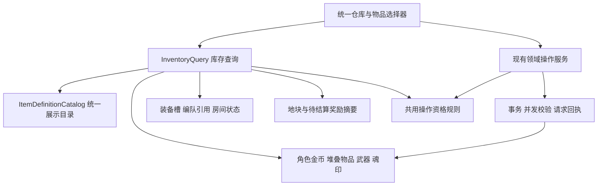

# 角色统一仓库需求、架构与实施记录

状态：第一版已实现，集成验收记录见文末。日期：2026-10-02。

本次目标是把散落在武器、补给、职业、药田、炼金和商店里的物品管理收拢到一个仓库，让玩家看清自己持有什么、数量多少、用于哪里，以及哪些装备可以整理。用户已确认每个角色独立持有物品、支持切换角色查看，并授权按本设计实施。

实现保留现有角色资产表，新增统一物品目录、库存查询和前端状态层；将完整库存与整理操作移入仓库，业务页面保留执行任务时需要的物品选择和数量提示。第一版完成当前库存统计，不把现有奖励记录拼成不完整的历史收支。

## 已确认范围与第一版边界

| 项目 | 设计决定 |
| --- | --- |
| 归属 | 每个角色独立仓库，金币也归角色；切换查看不转移物品 |
| 覆盖资产 | 武器实例、魂印实例、药剂、种子、草药、武器碎片、突破材料、副本徽记及其他实际堆叠道具 |
| 管理能力 | 查找、筛选、排序、查看详情；迁入现有锁定、出售、分解、武器强化、突破与突破石合成能力 |
| 配装与使用 | 武器盘、补给槽、魂印装备及自动策略继续属于角色配装；编队编辑仍保存预设；战斗道具使用留在战斗页面 |
| 统计 | 已入库现货、类别数量、装备和保护状态；待收获与战斗待到账独立提示 |
| 整理含义 | 统一分类展示、筛选和批量操作，不删除未知道具，不自动消耗重复装备 |
| 不增加的玩法 | 账号共用、跨角色转移、格子容量、堆叠上限、自动出售、材料通用出售或丢弃、自动最优配装 |
| 后续扩展 | 完整收支流水、每日收益、低库存提醒和自定义收藏；需要时另行设计 |

经验、职业等级、天赋点和旧采集机会属于成长或活动状态，不计为仓库物品。现有 `InventoryFull` 等错误中的数量溢出保护不代表游戏已有仓库格子限制。

## 实施前的系统与问题

### 数据已经按角色持有

| 数据来源 | 实际内容 | 统一展示时的要求 |
| --- | --- | --- |
| `CharacterItemStack` | `CharacterId + ItemCode + Quantity + Version` | 同角色同代码唯一；数量为零的行允许存在；未知代码不能被目录过滤掉 |
| `CharacterWeapon` 与技能子表 | 一把武器一个实例，含品质、技能、装备槽和锁定 | 同名武器可有不同成长；保留实例 ID 和已有属性，不能按当前模板覆盖 |
| `CharacterSoulImprint` | 一枚魂印一个实例，含装备、锁定及自动策略 | 同代码可有多枚；效果按现有魂印目录解析 |
| `Character.Gold` | 角色金币 | 单独钱包字段；不得与物品数量相加 |
| 装备槽与编队 | 引用武器、魂印实例或药剂代码 | 引用不产生额外库存，不自动预留道具数量 |

历史账号仓库已在 `RemoveCampWarehouse` 迁移中归并到角色并删除。本次“仓库”是新的管理入口，不重建旧账号仓库表。

### 入口与显示分散

| 当前入口 | 当前承担的库存职责 | 主要问题 |
| --- | --- | --- |
| 武器页 | 武器盘、武器仓库、出售分解、强化突破、碎片和突破石 | 一个大型组件同时负责配装与仓储，材料隐藏在资源弹窗内 |
| 补给页 | 药剂背包、三个补给槽及自动使用 | 查看库存与修改配装耦合 |
| 职业页 | 职业系统和完整魂印管理 | 魂印作为物品不容易被找到 |
| 药田与炼金 | 种子数量、配方原料与成品数量 | 可以看到当前操作相关物品，看不到完整材料库存 |
| 商店 | 商品持有量、兑换材料钱包 | 物品统计依赖商品与兑换配置，不能代表全量持有物品 |

武器和魂印响应中的 `Fragments` 指向同一批武器碎片；商店、炼金和补给响应也会重复投影同一个堆叠库存。统一仓库必须直接查询资产来源，不能把这些接口响应相加。

现有客户端查询缓存有效期为十秒，部分“刷新”仍走有效缓存；普通写操作会清缓存，但不会自动更新所有已经加载的组件。不同页面的刷新策略也不同，因此仅搬动 UI 无法解决数量不同步。

## 玩家界面与操作流程

新增 `/inventory`，主导航提供“仓库”。默认打开当前操作角色，可在仓库内切换查看其他自有角色；页面始终显示资产所属角色。

```text
仓库    [角色选择]                     [刷新]  最后同步时间
金币    武器 N 件    魂印 N 枚    堆叠物品 N 种

[全部] [武器] [魂印] [补给] [种植材料] [养成材料] [兑换材料] [其他]
[搜索名称] [属性] [品阶或等级] [装备/锁定/编队引用] [排序]

物品列表                              选中物品详情
图标 / 名称 / 数量或实例属性           效果、来源、用途
已装备 / 已锁定 / 编队引用             保护原因与相关编队
分页                                  对应管理动作或业务跳转

已选 N 件    [预览出售收益] [预览分解收益] [取消选择]
待收获 N 块地 / 战斗奖励待结算         [前往对应页面]
```

图中数量都是占位示意，不是当前存档数据。桌面使用列表与详情并排布局；窄屏使用列表和详情抽屉，分类可以换行或折叠。金币独立显示，不作为一个物品格子。

### 分类与筛选

- **武器**：实例列表；按属性、装备等级、品质、装备状态、锁定和编队引用筛选。
- **魂印**：实例列表；按属性、阶级及装备、锁定、引用状态筛选。
- **补给**：治疗药水、强化药水、合剂三个子类；标明当前角色的效果及配置状态。
- **种植材料**：种子与草药；支持普通、稀有等现有配置标签。
- **养成材料**：武器碎片、通用突破碎片与通用突破石。
- **兑换材料**：副本徽记等实际兑换货币。
- **其他**：暂未归类或缺失定义的实际持有物品；显示代码作为回退名称。

一个物品只有一个主分类，来源和用途可以有多个标签。分类取自配置中的明确关系，不能靠名称猜测，例如 `mulgore-stormseed` 是草药，对应种子为 `seed-mulgore-stormseed`。

默认只展示实际持有物品。已耗尽但仍配置在补给槽或编队中的药剂，在配装选择器继续显示“库存为零”；不借此增加仓库的持有种类。武器、魂印不自动折叠为可批量删除的同名堆叠。

搜索按名称和代码匹配；属性筛选只在适用分类出现。排序提供名称、数量、等级和品质等已有字段，末尾用稳定键排序。武器尚无获取时间，不承诺全品类“最近获得”排序。

### 角色上下文

仓库角色选择是局部查看状态，使用显式 `characterId`，不因浏览自动改变账号的当前操作角色，也不改变已入场角色。

当前商店、药田和炼金接口依赖账号的当前操作角色，武器、补给、职业和编队页面也读取全局当前角色。从其他角色仓库跳转时，按钮明确写为“切换为该角色并前往炼金”等；点击后调用现有角色选择能力，刷新 `ActiveCharacterState`，成功后再进入目标页面。跳转携带物品或编队的定位参数，目标页重新读取并核对角色归属。目标业务写请求继续校验角色 ID。已支持显式角色的仓库管理接口直接使用正在查看的角色。

路由保留 `characterId`、分类与筛选条件，详情定位使用物品稳定键。切换角色立即清空多选和旧详情，并忽略旧请求的迟到响应。写入进行中禁用页面内角色切换；若账号上下文从其他入口改变，已发出的操作仍按原请求角色核对结果，不能写入新角色视图。

### 整理与保护

详情展示已装备的位置、是否手动锁定，以及引用它的有效编队名称。锁定、装备和编队引用可以重叠，不能被表示成互斥的单一状态。

批量出售或分解只处理同一资产类型、同一操作，沿用当前最多一百个实例的限制。第一版“全选”只选择当前页符合该操作条件的实例；翻页、切换筛选或分类清空选择，并明确提示选择范围。不会把“同名”或“未装备”直接等同于“可以清理”。

确认前显示将处理的实例、金币或各阶材料收益、阻止操作的原因。执行时任一实例失效，整批拒绝并刷新，不能静默跳过后只处理一部分。编队引用需要玩家先前往编队替换或移除，不提供自动拆除引用的按钮。

武器强化与突破复用现有成长规则；选择被消耗的同名武器时沿用装备、锁定和编队保护。魂印只提供现有分解，不新增出售。种子、草药、药剂和徽记仅提供现有用途跳转，不扩展为通用出售或丢弃。

## 统计口径

| 指标 | 计算规则 |
| --- | --- |
| 金币 | 该角色 `Character.Gold` |
| 武器件数 | 该角色武器实例数，包含已装备与锁定实例 |
| 魂印枚数 | 该角色魂印实例数，包含已装备与锁定实例 |
| 堆叠物品种类 | 该角色 `Quantity > 0` 的物品代码数 |
| 单项库存 | 堆叠物品取其数量；实例型物品每个实例数量为一 |
| 分类统计 | 实例类显示件数，堆叠类显示种类数；需要时另列该类数量合计并标注单位 |
| 筛选结果 | 从当前角色持有集合筛选，显示符合条件的列表行数，独立于角色全量摘要 |
| 已装备或保护数量 | 各状态分别统计；若显示保护总数，按实例键取并集去重 |

不显示把金币、武器、药剂和材料混加的“资产总数”，不按不存在的出售价格估算全仓总价值。所有合计使用 `long`，单个持有数量继续遵守现有数据库限制。

持有资产的唯一键为：堆叠物品 `(CharacterId, ItemCode)`；武器和魂印 `(CharacterId, AssetKind, InstanceId)`。相同实例出现在十槽武器盘、多个编队或多个 UI 中都只计一次。物品种类若跨资产类型统计，必须包含 `AssetKind`，避免代码相同但资产语义不同。

以下状态必须分开：

1. **生产累计产出**已经进入背包，不能再加到现货。生产每批完成时才扣材料，不预扣未来批次，也不把计划用量当作已占用库存。
2. **成熟药田**尚未收获，产物不进入现货。可以显示待收获地块提示，收获成功后重新查询库存。
3. **战斗待到账奖励**只从 `RewardRun.Status == Pending` 关联的本角色奖励计算，作为单独提示；结算后依实际库存显示。战败已结算的击杀奖励同样计入现货。
4. **补给槽与编队引用**不预留药剂。库存为十瓶，配置在三套编队后仍是十瓶；战斗实际使用成功才扣除。
5. **投入的武器碎片**属于成长成本，不是当前库存；`SpentFragments` 只能用于现有返还规则。

例如角色有十二把武器，其中十把装备、两把被多个编队引用，总数仍为十二；两把引用武器可能同时属于已装备集合。某药剂生产累计二十瓶、战斗已经用掉五瓶，库存应为十五瓶，不能显示三十五瓶。

当前没有覆盖所有渠道的经济流水，因此第一版不显示“历史总获得”“历史总消耗”或完整每日净收益。以后增加流水时，应从启用日期记录，存量作为期初余额；库存写入与对应流水必须在同一事务提交。

## 服务端架构

### 保留存储并统一查询



第一版不新建第二份库存表、不引入通用万能物品实体、不搬迁现有资产。新增职责如下，名称为实施建议：

| 模块 | 职责与边界 |
| --- | --- |
| `ItemDefinitionCatalog` | 组合现有物品目录与分类元数据，提供名称、主分类、标签和用途；不持有玩家数量、不重写战斗效果 |
| `InventoryQuery` | 认证并校验角色所有权；批量读取真实资产、引用和待到账摘要；输出统一列表与统计 |
| `InventoryActionPolicy` | 基于同一批输入计算每种操作的可用性和原因；查询与领域命令共用；不自行保存或提交事务 |
| `InventoryController` | 暴露角色明确的统一查询、详情与批量操作预览 |
| 现有 `WeaponService`、`SoulImprintService` 等 | 保持写入规则的唯一入口；补齐迁入仓库的管理操作所需的并发与重试保证 |

目录优先复用 `ConsumableCatalog`、`MaterialCatalog`、`PlantingCatalog`、`WeaponCatalog`、`WeaponBreakthroughCatalog`、`SoulImprintCatalog` 与兑换配置。只补缺失的展示分类和用途元数据，不再复制一份价格、药效或分解公式。来源说明指配置中的获取途径，不宣称每件物品都有实际获取履历。

已发布配置必须有覆盖与冲突检查：有效道具能找到主分类，同一堆叠代码的多个目录声明应兼容。大小写按现有目录规范解析；数据库如果存在大小写冲突行，应保留原始行并标记异常，禁止查询时静默合并或改写存档。完全未知的代码进入“其他”，保留数量；缺少定义时禁用依赖定义的操作。武器历史实例使用自身名称、属性和技能，不能因模板变化失真。

未知魂印仍保留魂印实例类型和 ID，只把展示分类回退为“其他”，不能变成堆叠物品。现有 `SoulImprintService.BuildResponseAsync` 假设目录定义一定存在；锁定或分解另一枚有效魂印后，也会生成这份完整响应。T03 应修正空值不安全的投影或改用明确的操作回执，确保“角色持有未知魂印，同时管理有效魂印”不会出现已提交但响应失败。缺失定义的效果展示和分解继续禁用。

### 查询契约

建议新增 `Game.Shared/Dtos/Inventory/InventoryContracts.cs`：

| 契约 | 核心字段 |
| --- | --- |
| `InventoryOverviewResponse` | `CharacterId`、`CharacterName`、`GeneratedAtUtc`、`Gold`、全量分类统计、`FilteredRowCount`、分页信息、`Items`、待收获及待结算摘要 |
| `InventoryEntryDto` | 稳定键、`AssetKind`、代码、可选实例 ID、实例或堆叠 `Version`、名称、主分类、标签、数量、适用的等级或属性、装备与锁定状态、引用数量、操作资格及原因 |
| `InventoryItemDetailDto` | 基础行、完整物品效果或武器技能、编队引用清单、相关用途入口；复用现有领域详情投影 |
| `InventoryActionAvailabilityDto` | `Action`、`Allowed`、结构化 `ReasonCodes`；引用名称另列，不靠拼接错误字符串判断 |
| `InventoryActionPreviewResponse` | 目标实例与版本、每项阻止原因、按币种或材料代码分组的收益、`OutcomeFingerprint` |

建议接口：

```text
GET  /api/user/characters/{characterId}/inventory
     ?category=weapons&search=...&element=...&state=...&sort=...&page=1&pageSize=40
GET  /api/user/characters/{characterId}/inventory/details?assetKind=...&key=...
POST /api/user/characters/{characterId}/inventory/actions/preview
```

列表默认每页四十行，上限一百行，过滤和排序参数使用白名单。实例详情键使用 ID，堆叠详情使用原始物品代码；服务端始终再次校验归属。旧接口继续供配装、编队和领域页面使用，不要求它们立刻兼容一个全新万能 DTO。

查询是读取已提交库存，不调用 `ProductionService.GetAsync` 或各页面的完整 overview。当前生产 GET 会推进结算并写库，药田 GET 也可能创建地块，不能作为仓库聚合的无副作用读取。

一次响应中的金额、列表与摘要应来自同一个短时间数据库读快照；使用经过真实 SQLite 验证的短只读事务，读取完成即释放，不在事务内等待界面或执行写入。列表首次可批量读取角色资产的轻量字段并在内存完成目录分类与筛选，只给当前页补充必要详情，不能把所有武器技能和配装计算都搬入列表。

编队引用、装备状态、药田和待结算奖励各自批量读取；不允许逐件查询。以十、一千、一万实例的临时数据记录查询次数、响应大小和耗时，查询次数不应随实例数线性增加。是否进一步下推复杂筛选或增加索引，按该基线决定；不能凭设计文档宣称性能已经达标。

### 操作与一致性

查询中的 `Allowed` 是当次状态说明，最终执行必须由服务端在事务中重新检查。现有武器 DTO 的 `CanSell=true` 只是基础能力，不能直接视为当前可出售许可。

保留当前限制：角色占据房间槽位时，实际配装、武器出售分解及强化突破、魂印分解按已有服务规则拒绝；查看库存和锁定、解锁仍可使用。魂印战斗自动策略属于既有战斗策略接口，不混入库存批量操作。

出售、武器分解和魂印分解目前没有与强化、购买等同等的请求回执。迁入仓库前，为这些批量接口增加必填 `RequestId`、目标版本和预期收益指纹；旧 UI 在同次发布中更新，缺少必要信息应返回明确错误。重复操作的控制要求为：

1. 先校验身份和角色所有权，按角色与请求编号读取历史回执。编号相同但操作、目标或确认参数不同则拒绝；已有成功回执直接返回原操作结果，再允许客户端刷新现货。
2. 无成功回执时，在同一事务中重读目标、相关角色与房间状态、有效编队引用和规则。验证实例版本及数量，重算收益；与确认时的收益指纹不同则要求重新预览。指纹只用于检测变化，不代替服务端计算或授权。
3. 校验通过后执行整批删除、扣除或入账，保存请求指纹与明确收益回执，和实际库存一起提交。失败全部回滚；响应丢失后复用同一请求编号重试。
4. 预览不修改物品，不预留数量。确认期间出现装备、锁定、编队引用或规则变化，执行应拒绝；不能相信客户端传来的价格或“允许处理”状态。

重点验证“保存编队与分解实例”“入场与出售”“武器作突破素材与其他操作”的交叉竞争。资格校验和写入必须处于受并发控制的同一事务边界，单纯抽取一个共用检查函数不构成完整保护。主代理负责审查并修复必要边界，不把整个奖励和生产结算顺带重写。

实体 `Version` 用于该实体的并发控制。`Character.Version` 不能充当完整的库存版本：生产、收获和部分战斗消耗会改变堆叠物品而不必改变角色版本。第一版不添加一个所有生产者尚未维护的“统一库存版本”，也不以时间戳声称实现强一致缓存。

## 客户端架构与页面迁移

### 统一读取与刷新

新增 `ApiService.Inventory.cs` 和 `InventoryState`，缓存键包含会话、角色与完整查询条件。每次请求还记录页面代次，切换角色、筛选或登录会话后，旧响应不能覆盖当前视图。

现有武器和魂印客户端包装虽在 URL 指定角色，仍使用默认 `CurrentCharacter` 请求作用域；全局角色切换会把已成功的响应转换为 `ActiveCharacterChanged`。T04 增加明确角色的请求作用域，仅绑定登录会话与目标角色，覆盖仓库列表、详情、预览及相应旧管理包装。页面查看代次负责决定是否展示结果，不用全局 `DataRevision` 代替它；已经提交的其他角色操作仍可按原角色与请求编号核对。

提供明确的强制刷新入口：手动刷新绕过已完成的有效缓存；若旧请求仍在途，按代次使其失效，并保证最终显示本次刷新发起后的服务器读取结果。操作成功后立即使相应角色库存失效并刷新；普通库存写入通过单独的 `InventoryChanged(characterId)` 通知相关已挂载视图，不滥用账号上下文变更事件。

事件至少覆盖购买、兑换、种植、收获、生产操作、武器管理、魂印管理和配装引用变化。后台生产与战斗不会主动触发浏览器事件，仓库可见时建议每五秒读取一次并在重新获得焦点时刷新；隐藏页面暂停轮询，避免请求重叠。该频率为可调整初值，不是即时推送承诺。

同页刷新按稳定键保留仍存在且符合当前动作的多选，移除失效项并提示；当前详情与操作资格同步更新。确认框打开或管理请求在途时暂停轮询，关闭或操作结束后强制刷新。任何相关刷新使旧收益预览失效，提交前重新校验；即使实例版本没变，新增编队引用也可能改变资格，不能只看实例版本保留旧保护状态。

批量预览虽然使用 POST，仍是只读请求；须从现有按 HTTP 方法判定的缓存失效逻辑中排除，不能触发 `InventoryChanged` 或被当作一次库存写入。

响应显示最后成功同步时间；生产后台当前约每两秒扫描，现货只代表已提交部分。断线保留旧数据并标记未同步，绝不把失败读取替换为零库存；恢复后强制刷新。生产累计值、客户端倒计时和战斗预测不能用于自行增加仓库数量。

### 组件与职责

建议拆出 `InventorySummary`、`InventoryFilters`、`InventoryList`、`InventoryItemDetail`、`InventoryBatchBar`，以及武器、魂印、补给各自的选择器。它们接收数据与事件，由页面状态层管理读取，避免每个卡片自行请求接口。

复用现有 `WeaponDetailDialog`、`WeaponQualityCrystals`、`SkillAutoConditionPicker`、`GameStateCard`、`ItemArt` 和 `WeaponArt`。补齐缺失物品图标的回退显示；不能因没有美术资源隐藏物品。物品管理动作和预览抽为共享组件，避免武器页与仓库各维护一套成长逻辑。

| 页面 | 移入仓库 | 最终保留 |
| --- | --- | --- |
| `/weapons` | 完整武器列表、批量出售分解、锁定、管理详情、完整材料钱包与突破石合成 | 十槽武器盘、配装属性、当前装备的快捷成长入口；选择器与共享详情承接操作 |
| `/supplies` | 完整药剂库存列表 | 三个补给槽与自动策略、必要数量提示；选择器继续显示已配置的零库存药剂 |
| `/talents` | 魂印全量列表、锁定、分解和材料总览 | 职业内容及当前魂印装备与自动设置摘要；通过共享选择器更换魂印 |
| `/gathering` | 种子与草药的全量库存查询 | 地块、播种、收获、倒计时和所选种子数量 |
| `/production` | 原料与成品的全量库存查询 | 配方、解锁、每批用量、库存需求、开工停止和进度 |
| `/shop` | 独立材料钱包总览 | 商品、价格、购买、兑换；保留当前商品持有量与兑换成本。角色栏位已改为账号默认免费拥有五个。 |
| `/formations` | 无需搬走编队业务 | 配置草稿、保存、应用和出战选择；使用共用物品选择与保护状态 |
| 战斗页面 | 无需搬走战斗业务 | 当前药剂数量、冷却、配额、魂印和手动操作 |

旧 `/weapons`、`/supplies` 路由保留配装功能；本轮不再扩大成独立的“统一配装重构”。移动端主导航用仓库承接原来两个物品入口，配装页从编队和仓库快捷入口进入，避免再增加一列常驻导航。桌面与角色快捷入口、`MainLayout` 标题映射同时更新。迁移验收前不移除旧库存入口，防止中途功能缺失。

## 实施任务与分工

本轮已按契约和依赖并行实施。主代理负责统计与一致性规则、复杂逻辑及集成，6.1 Sol 负责目录、客户端状态、界面迁移与回归执行。下表保留任务划分；T01 至 T07 已落地，T08 验证结果见文末，T09 留待后续需求。

| 编号 | 优先级与任务 | 主要产物 | 依赖 | 负责人 | 完成条件 |
| --- | --- | --- | --- | --- | --- |
| T01 | P0 固定分类与查询契约 | `InventoryContracts`、目录分类清单、统计样例 | 本设计 | 主代理定规则，Sol 补齐清单 | 当前有效道具全覆盖；未知代码和大小写冲突有明确行为 |
| T02 | P0 实现统一查询 | `ItemDefinitionCatalog`、`InventoryQuery`、Controller 与注册 | T01 | 主代理实现聚合和读快照，Sol 完成目录适配 | 角色隔离、唯一计数、待到账边界、查询无隐藏写入通过测试 |
| T03 | P0 统一操作资格与批量安全 | 共用 policy、批量预览、领域服务回执、未知定义投影与并发补强 | T01 | 主代理 | 编队引用、已装备、锁定、入场、版本变化及重复提交均正确 |
| T04 | P0 客户端状态接入 | `ApiService.Inventory`、`InventoryState`、显式角色请求作用域、强制刷新与变更通知 | T01，可与 T02 并行 | Sol，主代理复核上下文竞态 | 手动刷新有效，旧响应不串角色，原角色操作可核对，失败不清零 |
| T05 | P0 仓库页面 | 页面、列表、分类摘要、详情、窄屏布局与空态 | T02、T04 | Sol | 能完整查看各类真实持有资产；筛选统计与列表一致 |
| T06 | P0 管理动作迁移 | 锁定、出售、分解、强化突破、材料合成的共享入口 | T03、T05 | Sol 批量迁移，主代理复核规则 | 支持的原功能不丢失；受保护实例不能被消耗 |
| T07 | P0 收拢旧页面 | Board 拆分、共用选择器、导航、旧路由与业务跳转 | T05、T06 | Sol | 完整库存只有一个管理入口，业务操作保留必要数量且角色正确 |
| T08 | P0 集成验收 | 真实 SQLite 测试、客户端状态测试、浏览器走查、查询基线 | T02 至 T07 | 主代理统筹，Sol 修复独立问题 | 下表关键场景通过后再撤旧入口；结果写入本文 |
| T09 | P1 后续统计扩展 | 如有需求再设计完整流水、收益趋势与提醒 | 第一版使用反馈 | 主代理设计，Sol 实施 | 明确新增范围与历史起点，不以残缺记录补造历史 |

建议分三次可验收交付：T01、T02、T04、T05 先形成全量只读仓库；T03、T06 接通可靠整理；T07、T08 完成旧入口清理与集成。T02 与 T03 的核心事务逻辑由主代理维护；Sol 不同时改同一服务方法，契约变化由主代理集中协调。

## 验收与回退

| 验收主题 | 必须覆盖的场景 |
| --- | --- |
| 归属 | 同一账号两个角色各自统计；其他账号角色拒绝访问；仓库查看不修改当前操作角色；跳往配装、编队及生产商店等所有业务页面时正确切换与定位 |
| 去重 | 同一碎片出现在多个领域 DTO 仍只计一次；多套编队引用同实例不增库存；保护状态重叠不重复计总数 |
| 分类兼容 | 所有配置道具、零库存、未知代码、不同品阶、旧武器实例和大小写冲突行；持有未知魂印时管理另一有效魂印能正常返回 |
| 入账边界 | 种子播种扣除、成熟未收获、收获入包；生产不预留且累计产出不叠加；战斗 Pending、胜利与战败结算 |
| 详情与能力 | 治疗药、强化药、合剂覆盖三个槽位；武器成长、魂印分解和各阶材料信息无遗漏 |
| 批量安全 | 超一百件、重复 ID、混类型、已装备、已锁定、编队引用、入场角色、目标版本或收益变化时整批无副作用 |
| 并发与幂等 | 分解与保存编队、出售与入场、锁定与删除、生产与库存操作竞争；响应丢失后重试只入账一次 |
| 客户端状态 | A 角色请求迟到不能覆盖 B；B 仓库操作在途而顶栏从 A 切到 C 时，B 的结果仍可核对；操作后多视图同步；刷新绕过缓存；断线恢复与隐藏停止轮询；刷新遇到物品消失、锁定变化、新增编队引用或详情迟到 |
| 页面迁移 | 旧路由可用、仓库与配装互相定位、手机批量栏不遮挡内容、键盘能操作筛选与详情 |
| 性能 | 临时数据量扩大时无逐件 SQL；分页响应不携带全部技能详情；记录实际耗时及读事务对后台写入影响 |

复用已有 `WeaponServiceTests`、`WeaponBreakthroughTests`、`SoulImprintServiceTests`、`FormationServiceTests`、`FormationBattlePolicyTests`、`ShopServiceTests`、`ProductionServiceTests`、`PlantingServiceTests`、`CombatConsumableSpecializationTests`、`ClientQueryCacheTests`、`ClientSharedQueryStateTests` 与经济请求测试。新增用例针对新的跨模块统计、查询副作用和竞态边界，不重复堆砌仅验证字段映射的测试。

本次设计不需要存档迁移。后续如果仅增加目录、DTO、读取与 UI，也保持原资产存储；操作回执可复用已有 `LogisticsRequests` 的操作种类、指纹与结果字段。需要任何新的索引或字段时单独评审迁移，先在临时数据库演练。新旧 UI 过渡期间必须调用同一领域服务；数据库没有第二份库存，因此回退页面时不需要合并双份资产。

以上表格定义验收范围；下方仅记录实际执行过的验证。所有新增数据测试均使用临时 SQLite，不读取或修改真实玩家存档。

## 实施记录（2026-10-02）

### 已交付

- `/inventory` 角色仓库：角色局部切换、八类入口、完整分类统计、搜索筛选排序、分页、实例详情与用途定位、保护原因和编队引用、待到账摘要、窄屏详情抽屉和键盘操作。
- `ItemDefinitionCatalog` 复用当前道具定义和旧草药元数据；`InventoryQuery` 使用短 SQLite 读快照直接聚合真实资产，不调用会结算生产或创建药田的 GET。详情单独读取完整武器技能；未知代码保留原数量和身份。
- `InventoryActionPolicy` 与 `InventoryBatchRules` 统一资格、收益预览、版本与收益指纹。出售和分解在写事务内重新校验保护条件；实例删除、材料或金币入账与 `LogisticsRequests` 回执一起提交。强化、品质突破和突破石合成均支持客户端保留请求号重试。
- `InventoryState` 按页面独立持有状态，缓存和请求明确绑定会话、角色及查询条件。刷新绕过缓存和旧在途请求；迟到响应不会覆盖新角色。操作后按角色通知；可见仓库每五秒刷新，确认和操作期间暂停，断线保留最后成功数据。
- 仓库更新查询参数时保留页面实例，避免打开详情或切换筛选重建整页。手机详情与确认框支持焦点约束、逐层 Esc 关闭及返回原物品；可见性刷新以注册编号退订，离开页面后停止通知。
- 武器页保留十槽配装，补给页保留三个槽位与策略，职业页保留魂印配置；原完整库存、武器成长管理及商店材料钱包收拢到仓库。补给、魂印与编队使用共享搜索选择器；各业务页支持从仓库携带角色、物品和实例定位进入。
- 兼容补强：未知魂印不会导致管理其他物品后响应失败；未知技能不能消耗碎片强化；突破材料大小写冲突禁止合成，也不通过创建另一大小写行掩盖问题。旧武器响应只枚举实际和目录需要的碎片阶级，避免稀疏极大阶级导致巨量空列表。

仓库功能没有新增资产表或迁移，操作回执复用原表。页面第一版将列表、筛选与批量栏集中在 `Inventory.razor`，把成长和选择器拆为 `InventoryGrowthPanel`、`InventoryItemPicker`；没有为纯展示区额外引入状态副本。批量选择限定当前页，切页或换筛选清空。完整历史流水及收益趋势不在本轮范围。

### 已执行验证

服务端目录、查询与真实 SQLite 事务测试覆盖角色归属、唯一计数、保护并集、所有分类、未知物品、代码冲突、待到账、无隐藏写入、长整数统计、分页、成长材料保护、请求回执重试、预览后变更与整批回滚。两个独立 SQLite 连接实测同请求并发分解只入账一次，以及锁定与出售不能同时成功。客户端测试覆盖显式角色、迟到请求、强制刷新、失效通知、预览不触发写入通知、断线保留状态与经济请求重试。

查询性能基线使用临时数据，单页十件：

| 角色武器数 | SELECT 数 | 写入数 | JSON 字节 | 单次耗时（毫秒） |
| --- | --- | --- | --- | --- |
| 10 | 14 | 0 | 9,331 | 272.7（首次初始化） |
| 1,000 | 14 | 0 | 9,390 | 19.3 |
| 10,000 | 14 | 0 | 9,415 | 125.0 |

这是本机单次基线，证明查询次数和分页载荷没有随实例数线性增长，不作为线上吞吐或读写延迟保证。后台写入与只读快照的长时间压力测试不在此基线中。

最终针对性回归 **201/201 通过**，涵盖仓库目录、查询、写入、客户端状态、原有武器和魂印管理、突破、编队、缓存与经济请求；其中目录 24 项，查询及事务 66 项。原有战斗浏览器回放 **3/3 通过**。测试报告保存于 `Game.Server.Tests/TestResults/inventory-focused-final.trx`。

整库回归未标记为全部通过。第一次执行为 1,622 通过、1 失败；独立导出提交 `a1cdd360` 复现了相同的原有失败：`soul-frost-guard` 配置为 30% 减伤，而 `TotalPlayerReductionHasACapWithoutRemovingDamageTakenPenalties` 的一个案例仍按 50% 断言；原版同样得到 HP 1300，期望 1500。本次未调整该战斗规则或放松断言。

之后共享工作区同时出现另一组补给平衡、配方删除与补给策略迁移修改，第二次整库快照为 1,608 通过、23 失败（`inventory-final-regression.trx`）。其中新增仓库目录测试原先要求石南草始终有炼金入口，已按当前配方删除后的真实关系修正并重新通过：保留元数据、回退“其他”，不伪造用途。其余失败涉及补给数值、配置数量、迁移和上述原有减伤断言；本轮保留并行工作，没有回退配置或修改其断言。201 项仓库相关最终回归使用当时的共享工作树重新编译运行，不代表整库的其他并行修改已验收。

最终 Release 发布与 HTTP 冒烟验收成功；Microsoft Edge 浏览器验收 **20/20 组通过**。覆盖全部分类与分页、独立角色查看和业务跳转、锁定/解锁、出售的精确金币变化、批量分解及回执重放、强化、通用突破石突破、虚拟列表首尾素材的实例选择与精确消耗、突破石合成、预览后锁定的整批拒绝、未知物品、跨页详情链接、断线保留数量以及七个原业务页面。桌面 1440×1000 与手机 390×844 检查通过；手机确认框位于顶栏之上，无横向溢出，Tab 不离开确认框，连续 Esc 依次返回详情和原物品。离开仓库后的刷新退订检查通过，浏览器及 .NET 运行时错误为零，其他账号角色数据未变化。

本轮浏览器产物位于 `artifacts/server-release-smoke/fb3b498237874fae867a54b8f8bc9771/`：`inventory-browser.json` 为完整结果，`inventory-desktop-overview.png`、`inventory-mobile-overview.png` 为页面截图，`inventory-mobile.png` 为手机确认框截图。主代理已复核截图。测试服务已关闭，隔离数据库和日志保留用于核对。

复现入口：`dotnet test Game.Server.Tests/Game.Server.Tests.csproj`；仓库浏览器验收：`pwsh -File tools/verify-server-release.ps1 -InventoryBrowser`。后者发布到随机隔离目录、使用随机本地端口与全新 SQLite 文件，保留日志和截图；不会替换真实存档。

## 代码依据

以下是本次核查的主要入口，均相对仓库根目录：

- 资产与约束：`Game.Shared/Models/Character.cs`、`CharacterItemStack.cs`、`CharacterWeapon.cs`、`CharacterSoulImprint.cs`；`Game.Server/Data/GameDbContext.cs`；`Game.Server/Data/Migrations/20260923060000_RemoveCampWarehouse.cs`。
- 道具定义：`Game.Server/Services/MaterialCatalog.cs`、`ConsumableCatalog.cs`、`PlantingCatalog.cs`、`WeaponCatalog.cs`、`WeaponBreakthroughCatalog.cs`、`SoulImprintCatalog.cs`；`Game.Server/Configuration/MaterialOptions.cs`。
- 领域管理：`Game.Server/Services/WeaponService.cs`、`SoulImprintService.cs`、`ConsumableService.cs`、`FormationItemReferencePolicy.cs`、`CombatLoadoutMutationPolicy.cs`。
- 收支边界：`Game.Server/Services/RewardService.cs`、`ProductionService.cs`、`ProductionCycleService.cs`、`PlantingService.cs`、`ShopService.cs`、`BattleRoundExecutor.Consumables.cs`。
- 客户端库存：`Game.Client/Components/CharacterWeaponBoard.razor`、`CharacterConsumablesBoard.razor`、`CharacterSoulImprintBoard.razor`；`Game.Client/Pages/Shop.razor`、`Gathering.razor`、`Production.razor`、`Formations.razor`。
- 刷新与导航：`Game.Client/Services/ApiService.State.cs`、`ClientQueryCache.cs`、`ApiService.cs`；`Game.Client/Layout/NavMenu.razor`、`MainLayout.razor`。

相关业务边界继续参考 [角色编队](battle-formations-design.md)、[并行种植与炼金](planting-alchemy-redesign.md) 和 [服务端架构实施记录](server-architecture-plan.md)。
